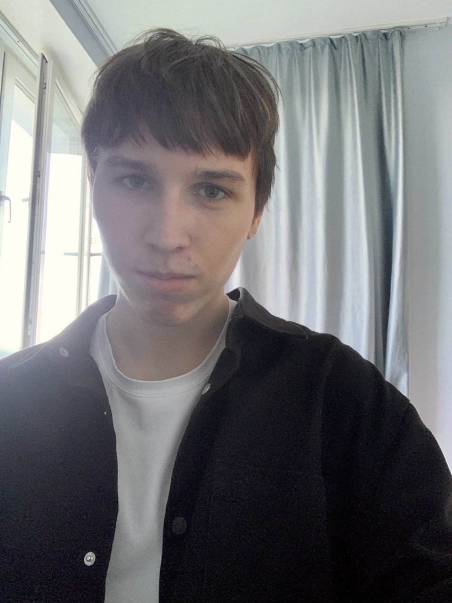
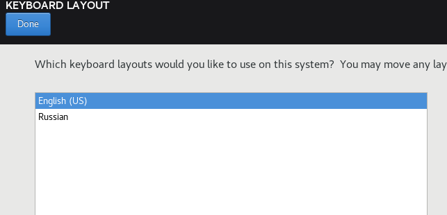
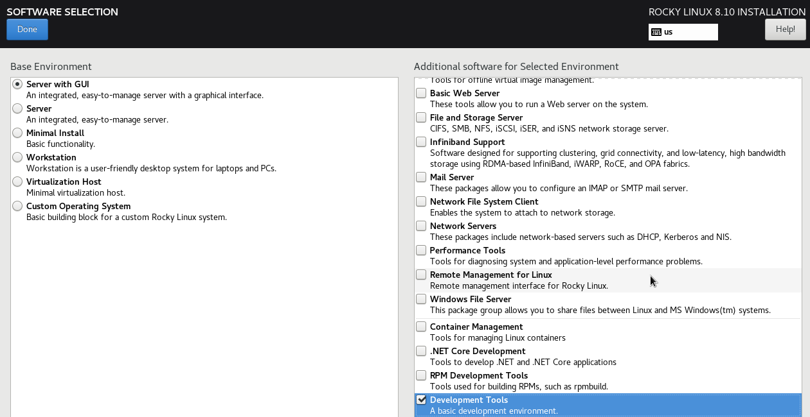
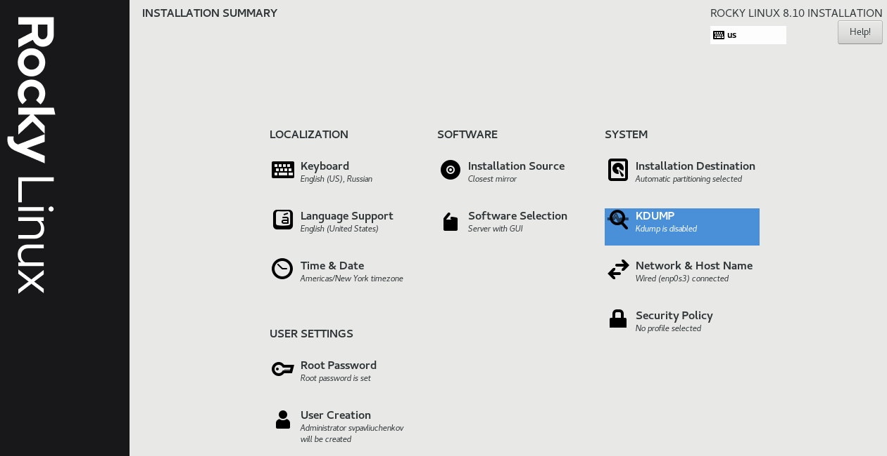
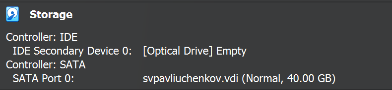
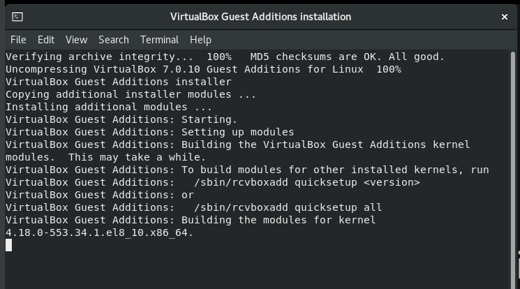
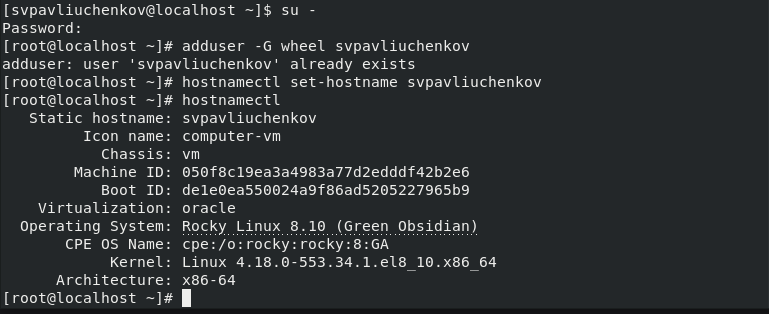
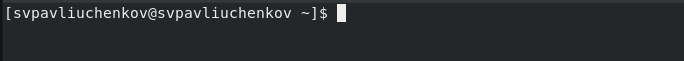

---
## Front matter
lang: ru-RU
title: Выполнение 1 лабораторной работы
subtitle: Установка и конфигурация операционной системы на виртуальную машину
author:
  - Павлюченков С.В.
institute:
  - Российский университет дружбы народов, Москва, Россия
date: 07 сентября 2024

## i18n babel
babel-lang: russian
babel-otherlangs: english

## Formatting pdf
toc: false
toc-title: Содержание
slide_level: 2
aspectratio: 169
section-titles: true
theme: metropolis
header-includes:
 - \metroset{progressbar=frametitle,sectionpage=progressbar,numbering=fraction}
---

## Докладчик

:::::::::::::: {.columns align=center}
::: {.column width="70%"}

  * Павлюченков Сергей Витальевич
  * Студент ФФМиЕН
  * Российский университет дружбы народов
  * [1132237372@pfur.ru](mailto:1132237372@pfur.ru)
  * <https://serapshi.github.io/svpavliuchenkov.github.io/>

:::
::: {.column width="30%"}

:::
::::::::::::::

## Цель работы

Целью данной работы является приобретение практических навыков установки операционной системы на виртуальную машину, настройки минимально необходимых для дальнейшей работы сервисов.

## Задание

Установить Linux Rocky в виртуальной машине.

# Выполнение лабораторной работы

## Запуск установщикa

{#fig:001 width=70%}

## Выбор окружения и программ

{#fig:002 width=70%}

##  Итоговые настройки

{#fig:003 width=70%}

## Открепление установочного образа.

{#fig:004 width=70%}

## Подключение образа гостевой ОС в меню Oracle VM.

{#fig:005 width=70%}

## Создание пользователя

Захожу в роль супер-пользователя, создаю пользователя svpavliuchenkov и задаю пароль.

{#fig:006 width=70%}

## Итог работы

{#fig:007 width=70%}

## Выводы

Я подготовид дистрибутив Linux Rocky на виртуальной машину своего компьютера дял последующего прохождения этого курса.
