---
## Front matter
title: "Oтчёт по лабораторной работе № 1"
subtitle: "Установка и конфигурация операционной системы на виртуальную машину"
author: "Сергей Витальевич Павлюченков"

## Generic otions
lang: ru-RU
toc-title: "Содержание"

## Bibliography
bibliography: bib/cite.bib
csl: pandoc/csl/gost-r-7-0-5-2008-numeric.csl

## Pdf output format
toc: true # Table of contents
toc-depth: 2
lof: true # List of figures
lot: true # List of tables
fontsize: 12pt
linestretch: 1.5
papersize: a4
documentclass: scrreprt
## I18n polyglossia
polyglossia-lang:
  name: russian
  options:
  - spelling=modern
  - babelshorthands=true
polyglossia-otherlangs:
  name: english
## I18n babel
babel-lang: russian
babel-otherlangs: english
## Fonts
mainfont: PT Serif
romanfont: PT Serif
sansfont: PT Sans
monofont: PT Mono
mainfontoptions: Ligatures=TeX
romanfontoptions: Ligatures=TeX
sansfontoptions: Ligatures=TeX,Scale=MatchLowercase
monofontoptions: Scale=MatchLowercase,Scale=0.9
## Biblatex
biblatex: true
biblio-style: "gost-numeric"
biblatexoptions:
  - parentracker=true
  - backend=biber
  - hyperref=auto
  - language=auto
  - autolang=other*
  - citestyle=gost-numeric
## Pandoc-crossref LaTeX customization
figureTitle: "Рис."
tableTitle: "Таблица"
listingTitle: "Листинг"
lofTitle: "Список иллюстраций"
lotTitle: "Список таблиц"
lolTitle: "Листинги"
## Misc options
indent: true
header-includes:
  - \usepackage{indentfirst}
  - \usepackage{float} # keep figures where there are in the text
  - \floatplacement{figure}{H} # keep figures where there are in the text
---

# Цель работы

Целью данной работы является приобретение практических навыков установки операционной системы на виртуальную машину, настройки минимально необходимых для дальнейшей работы сервисов.

# Задание

Скачать ОС Linux Rocky.
Установить ее в виртуальной машине.
Установить доп ПО.

# Выполнение лабораторной работы

## Установка Rocky Linux

После того, как я скачачал дистрибутив с сайта разработчиков, выбираю образ в виртуальной машине.

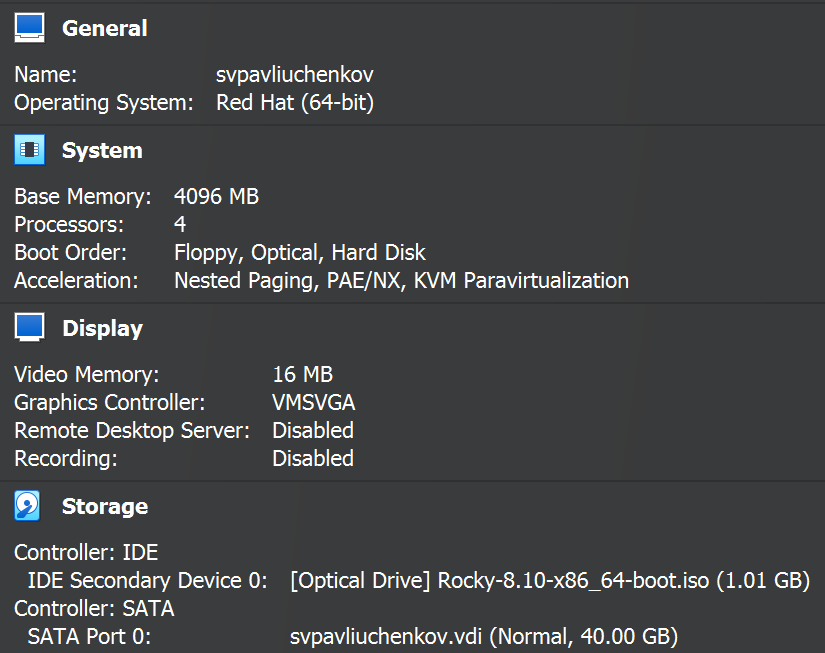{#fig:002 width=70%}

Запускаю установщик, и приступаю к установке. Выбираю язык интерфейса

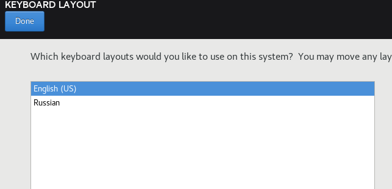{#fig:003 width=70%}
 
Задаю имя пользователя и пароль корненого разделаю

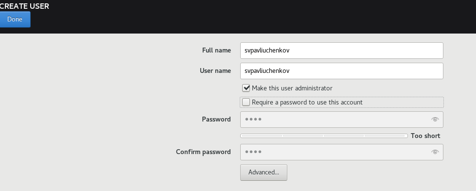{#fig:004 width=70%}

Выбираю инструментарий, с которым нам предстоит работать

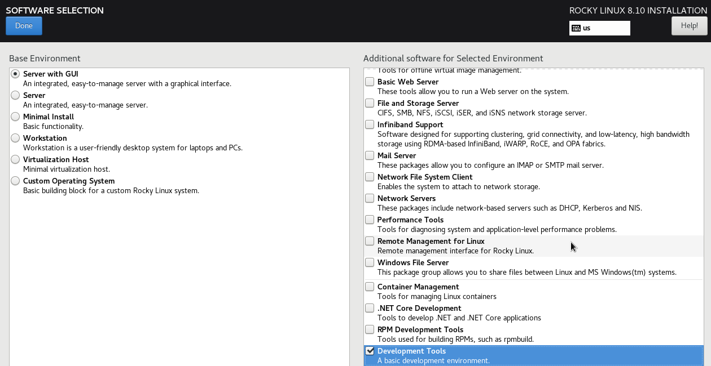{#fig:005 width=70%}

Заканчиваю предварительную настройку и начинаю установку дистрибутива.

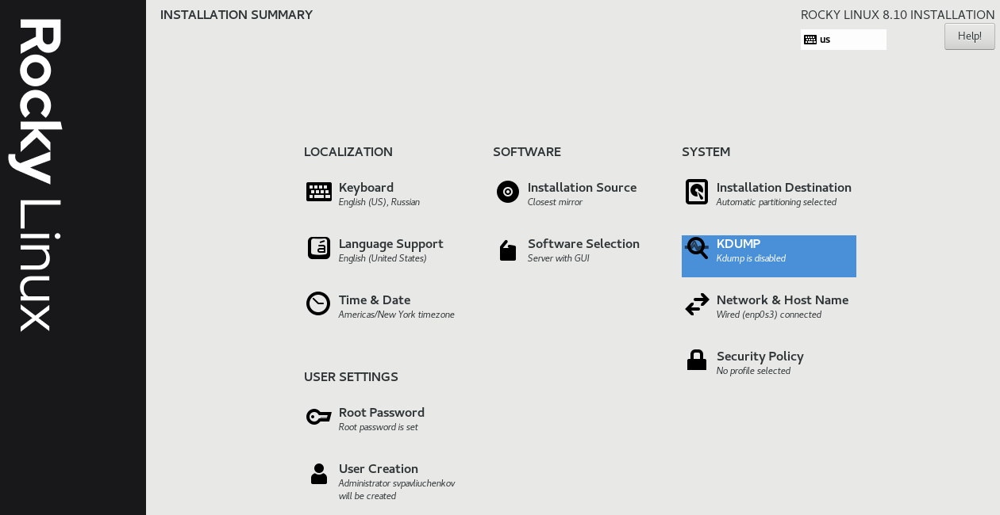{#fig:006 width=70%}

Успешно установил дистрибутив.

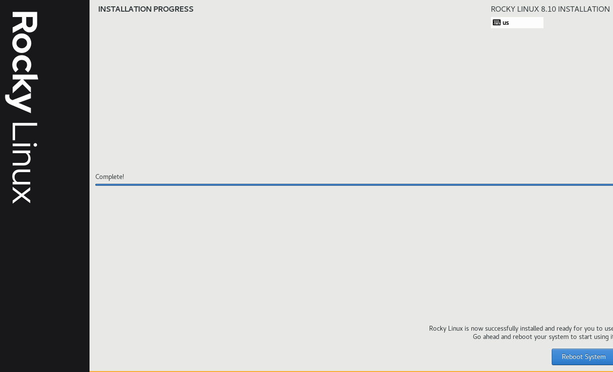{#fig:007 width=70%}

Открепляю установочный образ.

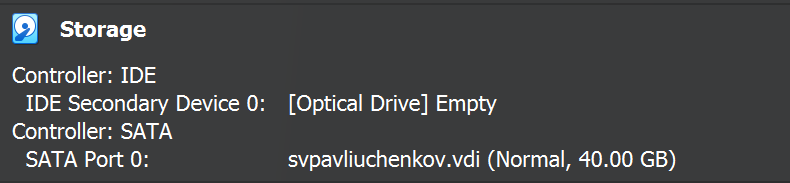{#fig:008 width=70%}

Подключаю образ гостевой ОС в меню виртуальной машины.

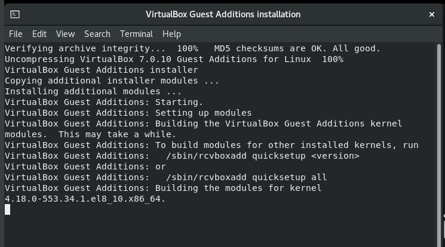{#fig:009 width=70%}

Захожу в роль супер-пользователя, создаю пользователя svpavliuchenkov и задаю пароль.

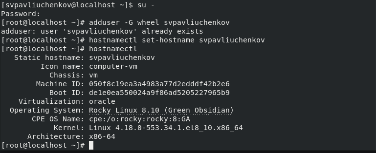{#fig:010 width=70%}

Перезагружаю машину, чтобы убедиться в изменениях - всё успешно поменялось.

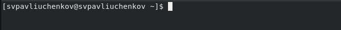{#fig:011 width=70%}

## Домашние задание
Использую dmesg | grep -i "то, что ищем"  во всех случаях.

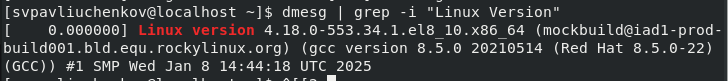{#fig:012 width=70%}

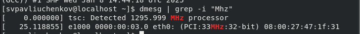{#fig:013 width=70%}

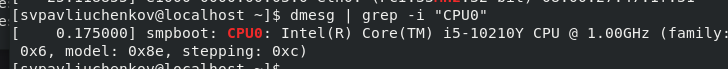{#fig:014 width=70%}

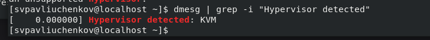{#fig:015 width=70%}

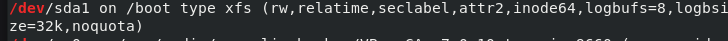{#fig:016 width=70%}

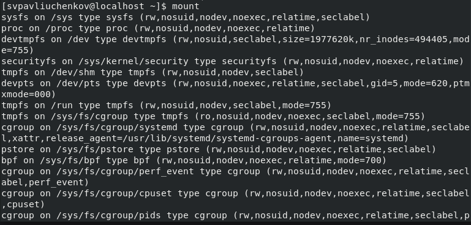{#fig:017 width=70%}

# Выводы

Я установил дистрибутив Linux Rocky на свой компьютер вместе с основным ПО, что я буду использовать по мере прохождения этого курса.

# Контрольные вопросы

Какую информацию содержит учётная запись пользователя?
- login, имя, фамилия, отчество, псевдоним, пол, Фотографии или аватар пользователя, давность последнего входа в систему, продолжительность последнего пребывания в системе, адрес использованного при подключении компьютера etc.
Укажите команды терминала и приведите примеры:

для получения справки по команде; 
- man help

для перемещения по файловой системе; 
- cd ~

для просмотра содержимого каталога;
- ls /home

для определения объёма каталога;
- du /home

для создания / удаления каталогов / файлов;
- mkdir dir, rmdir dir, rm file, touch file

для задания определённых прав на файл / каталог;
- chmod +x file

для просмотра истории команд.
- history

Что такое файловая система? Приведите примеры с краткой характеристикой.
- порядок, определяющий способ организации, хранения и именования данных на носителях информации в компьютерах.
Например, жесткий диск или CD-диски. Краткие характеристики - размещение и упорядочивание на носителе данных в виде файлов, создание, чтение и удаление файлов.

Как посмотреть, какие файловые системы подмонтированы в ОС?
- Можно использовать dmesg в связке с grep.

Как удалить зависший процесс?
- можно прописать kill -9 номер процесса.

# Список литературы{.unnumbered}

1. Dash, P. Getting Started with Oracle VM VirtualBox / P. Dash. – Packt Publishing Ltd, 2013. – 86 сс.

2. Colvin, H. VirtualBox: An Ultimate Guide Book on Virtualization with VirtualBox. VirtualBox / H. Colvin. – CreateSpace Independent Publishing Platform, 2015. – 70 сс.

3. Vugt, S. van. Red Hat RHCSA/RHCE 7 cert guide : Red Hat Enterprise Linux 7 (EX200 and EX300) : Certification Guide. Red Hat RHCSA/RHCE 7 cert guide / S. van Vugt. – Pearson IT Certification, 2016. – 1008 сс.

4. Робачевский, А. Операционная система UNIX / А. Робачевский, С. Немнюгин, О. Стесик. – 2-е изд. – Санкт-Петербург : БХВ-Петербург, 2010. – 656 сс.

5. Немет, Э. Unix и Linux: руководство системного администратора. Unix и Linux / Э. Немет, Г. Снайдер, Т.Р. Хейн, Б. Уэйли. – 4-е изд. – Вильямс, 2014. – 1312 сс.

6. Колисниченко, Д.Н. Самоучитель системного администратора Linux : Системный администратор / Д.Н. Колисниченко. – Санкт-Петербург : БХВ-Петербург, 2011. – 544 сс.

7. Robbins, A. Bash Pocket Reference / A. Robbins. – O’Reilly Media, 2016. – 156 сс.
