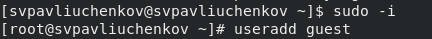
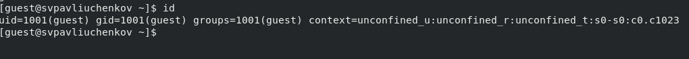
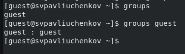
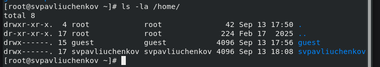
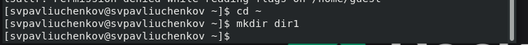
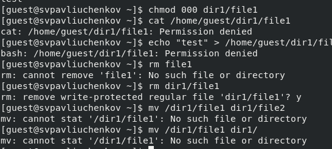
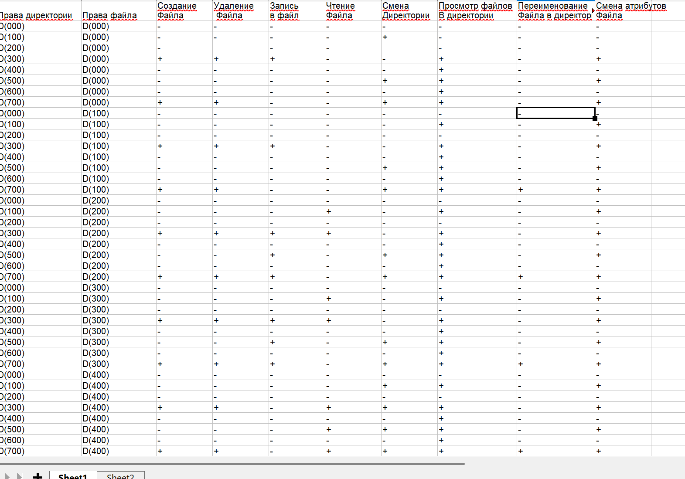

---
## Front matter
lang: ru-RU
title: Лабораторная работа № 2
subtitle: Основы информационной безопасности
author:
  - Павлюченков С.В.
institute:
  - Российский университет дружбы народов, Москва, Россия
date: 07 сентября 25

## i18n babel
babel-lang: russian
babel-otherlangs: english

## Formatting pdf
toc: false
toc-title: Содержание
slide_level: 2
aspectratio: 169
section-titles: true
theme: metropolis
header-includes:
 - \metroset{progressbar=frametitle,sectionpage=progressbar,numbering=fraction}
---

## Докладчик

:::::::::::::: {.columns align=center}
::: {.column width="70%"}

  * Павлюченков Сергей Витальевич
  * Студент ФФМиЕН
  * Российский университет дружбы народов
  * [1132237372@pfur.ru](mailto:1132237372@pfur.ru)
  * <https://serapshi.github.io/svpavliuchenkov.github.io/>

:::
::: {.column width="30%"}

:::
::::::::::::::

## Цель работы

Получение практических навыков работы в консоли с атрибутами файлов, закрепление теоретических основ дискреционного разграничения доступа в современных системах с открытым кодом на базе ОС Linux1.

## Задание

Cоздать учётную запись пользователя guest, Уточнить имя пользователя, его группу, а также группы, куда входит пользователь. Создать в домашней директории поддиректорию dir1, поделать некоторые операции, тем самым рассмотреть 6 атрибутов и составить 2 таблицы по полученным данным.

# Выполнение лабораторной работы

## Запуск и первая инструкция 

{#fig:001 width=70%}

## Номер групп пользователя 

{#fig:002 width=70%}

##  Группы пользователей

{#fig:003 width=70%}

## Проверка атрибутов
{#fig:004 width=70%}

## Создание директории

{#fig:005 width=70%}

## Работа с атрибутами

{#fig:006 width=70%}

## Итог работы

{#fig:007 width=70%}

## Выводы

Были получены практические навыки работы в консоли с атрибутами файлов, закреплены теоретические основы дискреционного разграничения доступа в современных системах с открытым кодом на базе ОС Linux.
