---
## Front matter
title: "Отчёта по лабораторной работе №2"
subtitle: "Основы информационной безопасности"
author: "Павлюченков Сергей Витальевич"

## Generic otions
lang: ru-RU
toc-title: "Содержание"

## Bibliography
bibliography: bib/cite.bib
csl: pandoc/csl/gost-r-7-0-5-2008-numeric.csl

## Pdf output format
toc: true # Table of contents
toc-depth: 2
lof: true # List of figures
lot: true # List of tables
fontsize: 12pt
linestretch: 1.5
papersize: a4
documentclass: scrreprt
## I18n polyglossia
polyglossia-lang:
  name: russian
  options:
  - spelling=modern
  - babelshorthands=true
polyglossia-otherlangs:
  name: english
## I18n babel
babel-lang: russian
babel-otherlangs: english
## Fonts
mainfont: PT Serif
romanfont: PT Serif
sansfont: PT Sans
monofont: PT Mono
mainfontoptions: Ligatures=TeX
romanfontoptions: Ligatures=TeX
sansfontoptions: Ligatures=TeX,Scale=MatchLowercase
monofontoptions: Scale=MatchLowercase,Scale=0.9
## Biblatex
biblatex: true
biblio-style: "gost-numeric"
biblatexoptions:
  - parentracker=true
  - backend=biber
  - hyperref=auto
  - language=auto
  - autolang=other*
  - citestyle=gost-numeric
## Pandoc-crossref LaTeX customization
figureTitle: "Рис."
tableTitle: "Таблица"
listingTitle: "Листинг"
lofTitle: "Список иллюстраций"
lotTitle: "Список таблиц"
lolTitle: "Листинги"
## Misc options
indent: true
header-includes:
  - \usepackage{indentfirst}
  - \usepackage{float} # keep figures where there are in the text
  - \floatplacement{figure}{H} # keep figures where there are in the text
---

# Цель работы

Получение практических навыков работы в консоли с атрибутами файлов, закрепление теоретических основ дискреционного разграничения доступа в современных системах с открытым кодом на базе ОС Linux1.

# Задание

Постарайтесь последовательно выполнить все пункты, занося ваши ответы на поставленные вопросы и замечания в отчёт.
1. В установленной при выполнении предыдущей лабораторной работы
операционной системе создайте учётную запись пользователя guest (использую учётную запись администратора):
useradd guest
2. Задайте пароль для пользователя guest (использую учётную запись администратора):
passwd guest
3. Войдите в систему от имени пользователя guest.
4. Определите директорию, в которой вы находитесь, командой pwd. Сравните её с приглашением командной строки. Определите, является ли она
вашей домашней директорией? Если нет, зайдите в домашнюю директорию.
5. Уточните имя вашего пользователя командой whoami.
6. Уточните имя вашего пользователя, его группу, а также группы, куда входит пользователь, командой id. Выведенные значения uid, gid и др. запомните. Сравните вывод id с выводом команды groups.
7. Сравните полученную информацию об имени пользователя с данными,
выводимыми в приглашении командной строки.
8. Просмотрите файл /etc/passwd командой
cat /etc/passwd
Найдите в нём свою учётную запись. Определите uid пользователя.
Определите gid пользователя. Сравните найденные значения с полученными в предыдущих пунктах.
Замечание: в случае, когда вывод команды не умещается на одном
экране монитора, используйте прокрутку вверх–вниз (удерживая клавишу shift, нажимайте page up и page down) либо программу grep вкачестве фильтра для вывода только строк, содержащих определённые
буквенные сочетания:
cat /etc/passwd | grep guest
9. Определите существующие в системе директории командой
ls -l /home/
Удалось ли вам получить список поддиректорий директории /home? Какие права установлены на директориях?
10. Проверьте, какие расширенные атрибуты установлены на поддиректориях, находящихся в директории /home, командой:
lsattr /home
Удалось ли вам увидеть расширенные атрибуты директории?
Удалось ли вам увидеть расширенные атрибуты директорий других
пользователей?
11. Создайте в домашней директории поддиректорию dir1 командой
mkdir dir1
Определите командами ls -l и lsattr, какие права доступа и расширенные атрибуты были выставлены на директорию dir1.
12. Снимите с директории dir1 все атрибуты командой
chmod 000 dir1
и проверьте с её помощью правильность выполнения команды
ls -l
13. Попытайтесь создать в директории dir1 файл file1 командой
echo "test" > /home/guest/dir1/file1
Объясните, почему вы получили отказ в выполнении операции по созданию файла?
Оцените, как сообщение об ошибке отразилось на создании файла? Проверьте командой
ls -l /home/guest/dir1
действительно ли файл file1 не находится внутри директории dir1.
14. Заполните таблицу «Установленные права и разрешённые действия»
(см. табл. 2.1), выполняя действия от имени владельца директории (файлов), определив опытным путём, какие операции разрешены, а какие нет.
Если операция разрешена, занесите в таблицу знак «+», если не разрешена, знак «-».
Замечание 1: при заполнении табл. 2.1 рассматриваются не все атрибуты файлов и директорий, а лишь «первые три»: г, w, х, для «владельца».
Остальные атрибуты также важны (особенно при использовании доступа от имени разных пользователей, входящих в те или иные группы).
Проверка всех атрибутов при всех условиях значительно увеличила бы
таблицу: так 9 атрибутов на директорию и 9 атрибутов на файл дают
218 строк без учёта дополнительных атрибутов, плюс таблица была бы
расширена по количеству столбцов, так как все приведённые операции
необходимо было бы повторить ещё как минимум для двух пользователей: входящего в группу владельца файла и не входящего в неё.
После полного заполнения табл. 2.1 и анализа полученных данных нам
удалось бы выяснить, что заполнение её в таком виде излишне. Можноразделить большую таблицу на несколько малых независимых таблиц.
В данном примере предлагается рассмотреть 3 + 3 атрибута, т.е. 2
6 = 64
варианта.
Замечание 2: в ряде действий при выполнении команды удаления файла
вы можете столкнуться с вопросом: «удалить защищённый от записи пустой обычный файл dir1/file1?» Обратите внимание, что наличие этого
вопроса не позволяет сделать правильный вывод о том, что файл можно удалить. В ряде случаев, при ответе «y» (да) на указанный вопрос,
возможно получить другое сообщение: «невозможно удалить dirl /file1:
Отказано в доступе».
15. На основании заполненной таблицы определите те или иные минимально необходимые права для выполнения операций внутри директории
dir1, заполните табл. 2.2.

# Выполнение лабораторной работы

В установленной при выполнении предыдущей лабораторной работы
операционной системе создаю учётную запись пользователя guest, заранее перейдя в режим суперпользователя (рис. [-@fig:001]).

{#fig:001 width=70%}

Задаю пароль пользователю guest (рис. [-@fig:002]).

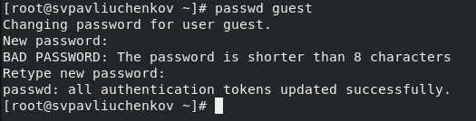{#fig:002 width=70%}

Захожу за нового пользователя и проверяю в какой мы директории (рис. [-@fig:003]).

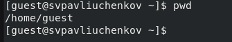{#fig:003 width=70%}

Переходу в домашнюю директорию, проверяю где мы оказались - при загрузке мы были в домашней директории (рис. [-@fig:004]).

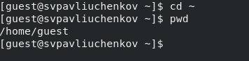{#fig:004 width=70%}

Командой whoami смотрим,что скажет система - guest (рис. [-@fig:005]).

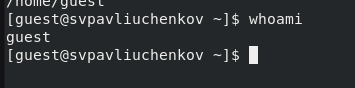{#fig:005 width=70%}

Применяем команду id, узнаем gid, uid (рис. [-@fig:006]).

{#fig:006 width=70%}

Смотрю к каким группам принадлежит guest (рис. [-@fig:007]).

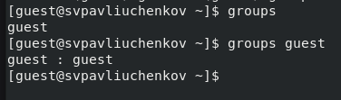{#fig:007 width=70%}

Смотрим, что написано о  пользователе в /etc/passwd (рис. [-@fig:008]).

{#fig:008 width=70%}

Определяю существующие в системе директории командой ls -l (рис. [-@fig:009]).

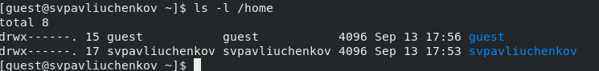{#fig:009 width=70%}

Проверяю, какие еще скрытые каталоги есть в домашней директории(рис. [-@fig:010]).

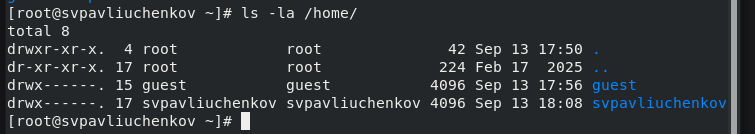{#fig:010 width=70%}

Проверяю какие расширенные атрибуты установлены на поддиректориях, находящихся в директории /home, командой:
lsattr /home. Не удалось увидеть атрибуты (рис. [-@fig:011]).

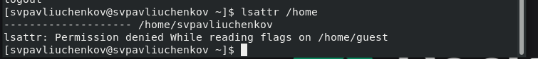{#fig:011 width=70%}

Создаю в домашней директории поддиректорию dir1 командой
mkdir dir1
 (рис. [-@fig:012]).

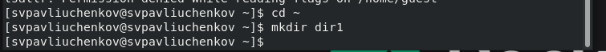{#fig:012 width=70%}

Определите командами ls -l(рис. [-@fig:013]). и lsattr., права drwxr-x-r-x были выставлены на директорию dir1. 

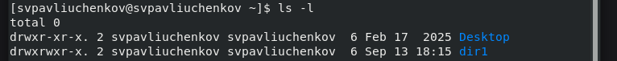{#fig:013 width=70%}

Снимаю с директории dir1 все атрибуты командой
chmod 000 dir1
и проверяю правильность с помощью команды
ls -l (рис. [-@fig:014])

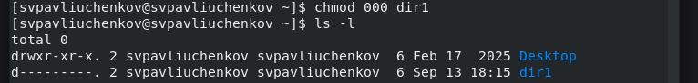{#fig:014 width=70%}

Пытаюсь создать в директории dir1 файл file1 командой
echo "test" > /home/guest/dir1/file1 (рис. [-@fig:015]).

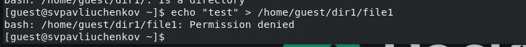{#fig:015 width=70%}

Cообщение об ошибке отразилось на создании файла, тем, что он не создался
ls -l /home/guest/dir1
 (рис. [-@fig:016]).

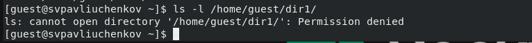{#fig:016 width=70%}

Возвращаю права директории и убеждаюсь,  что действительно файл file1 не находится внутри директории dir1. (рис. [-@fig:017]).

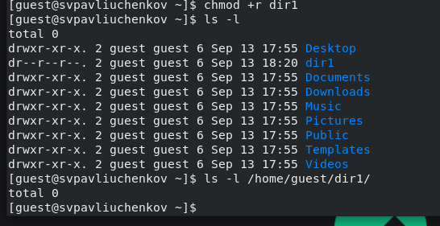{#fig:017 width=70%}

Итерационым методом перебираю комбинации уровней доступа (рис. [-@fig:018]).

{#fig:018 width=70%}

Получаю таблицы 2.1 (рис. [-@fig:019]).

{#fig:019 width=70%}

| | | | | | | | | | |
|-|-|-|-|-|-|-|-|-|-|
|Права директории|Права  файла|Создание  файла|Удаление  файла|Запись  в файл|Чтение  файла|Смена  директории|Просмотр файлов в  директории|Переимено- вание файла|Смена  атрибутов  файла|
|d(000)|(000)| -| -| -| -| -| -| -| -|
|d(000)|(100)| -| -| -| -| -| -| -| -|
|d(000)|(200)| -| -| -| -| -| -| -| -|
|d(000)|(300)| -| -| -| -| -| -| -| -|
|d(000)|(400)| -| -| -| -| -| -| -| -|
|d(000)|(500)| -| -| -| -| -| -| -| -|
|d(000)|(600)| -| -| -| -| -| -| -| -|
|d(000)|(700)| -| -| -| -| -| -| -| -|
|d(100)|(000)| -| -| -| -|+| -| -|+|
|d(100)|(100)| -| -| -| -|+| -| -|+|
|d(100)|(200)| -| -|+| -|+| -| -|+|
|d(100)|(300)| -| -|+| -|+| -| -|+|
|d(100)|(400)| -| -|-|+|+| -| -|+|
|d(100)|(500)| -| -|-|+|+| -| -|+|
|d(100)|(600)| -| -|+|+|+| -| -|+|
|d(100)|(700)| -| -|+|+|+| -| -|+|
|d(200)|(000)| -| -|-|-|-| -| -|-|
|d(200)|(100)| -| -|-|-|-| -| -|-|
|d(200)|(200)| -| -|-|-|-| -| -|-|
|d(200)|(300)| -| -|-|-|-| -| -|-|
|d(200)|(400)| -| -|-|-|-| -| -|-|
|d(200)|(500)| -| -|-|-|-| -| -|-|
|d(200)|(600)| -| -|-|-|-| -| -|-|
|d(200)|(700)| -| -|-|-|-| -| -|-|
|d(300)|(000)|+|+|-|-|+| -|+|+|
|d(300)|(100)|+|+|-|-|+| -|+|+|
|d(300)|(200)|+|+|+|-|+| -|+|+|
|d(300)|(300)|+|+|+|-|+| -|+|+|
|d(300)|(400)|+|+|-|+|+| -|+|+|
|d(300)|(500)|+|+|-|+|+| -|+|+|
|d(300)|(600)|+|+|+|+|+| -|+|+|
|d(300)|(700)|+|+|+|+|+| -|+|+|
|d(400)|(000)|-|-|-|-|-|+|-|-|
|d(400)|(100)|-|-|-|-|-|+|-|-|
|d(400)|(200)|-|-|-|-|-|+|-|-|
|d(400)|(300)|-|-|-|-|-|+|-|-|
|d(400)|(400)|-|-|-|-|-|+|-|-|
|d(400)|(500)|-|-|-|-|-|+|-|-|
|d(400)|(600)|-|-|-|-|-|+|-|-|
|d(400)|(700)|-|-|-|-|-|+|-|-|
|d(500)|(000)|-|-|-|-|+|+|-|+|
|d(500)|(100)|-|-|-|-|+|+|-|+|
|d(500)|(200)|-|-|+|-|+|+|-|+|
|d(500)|(300)|-|-|+|-|+|+|-|+|
|d(500)|(400)|-|-|-|+|+|+|-|+|
|d(500)|(500)|-|-|-|+|+|+|-|+|
|d(500)|(600)|-|-|+|+|+|+|-|+|
|d(500)|(700)|-|-|+|+|+|+|-|+|
|d(600)|(000)|-|-|-|-|-|+|-|-|
|d(600)|(100)|-|-|-|-|-|+|-|-|
|d(600)|(200)|-|-|-|-|-|+|-|-|
|d(600)|(300)|-|-|-|-|-|+|-|-|
|d(600)|(400)|-|-|-|-|-|+|-|-|
|d(600)|(500)|-|-|-|-|-|+|-|-|
|d(600)|(600)|-|-|-|-|-|+|-|-|
|d(600)|(700)|-|-|-|-|-|+|-|-|
|d(700)|(000)|+|+|-|-|+|+|+|+|
|d(700)|(100)|+|+|-|-|+|+|+|+|
|d(700)|(200)|+|+|+|-|+|+|+|+|
|d(700)|(300)|+|+|+|-|+|+|+|+|
|d(700)|(400)|+|+|-|+|+|+|+|+|
|d(700)|(500)|+|+|-|+|+|+|+|+|
|d(700)|(600)|+|+|+|+|+|+|+|+|
|d(700)|(700)|+|+|+|+|+|+|+|+|

Получаю таблицу 2.2.

| | | | | |
|-|-|-|-|-|
|Операция| |Минимальные  права на  директорию| |Минимальные  права на файл|
|Создание файла| |d(300)| |-|
|Удаление файла| |d(300)| |-|
|Чтение файла| |d(100)| |(400)|
|Запись в файл| |d(100)| |(200)|
|Переименование файла| |d(300)| |(000)|
|Создание поддиректории| |d(300)| |-|
|Удаление поддиректории| |d(300)| |-|

# Выводы

Были получены практические навыки работы в консоли с атрибутами файлов, закреплены теоретические основы дискреционного разграничения доступа в современных системах с открытым кодом на базе ОС Linux.

::: 
:::