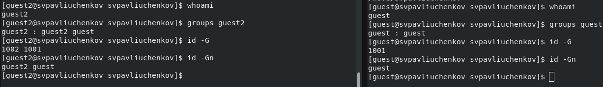
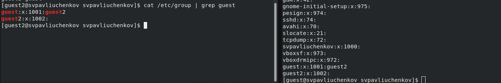
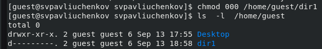
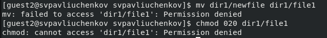
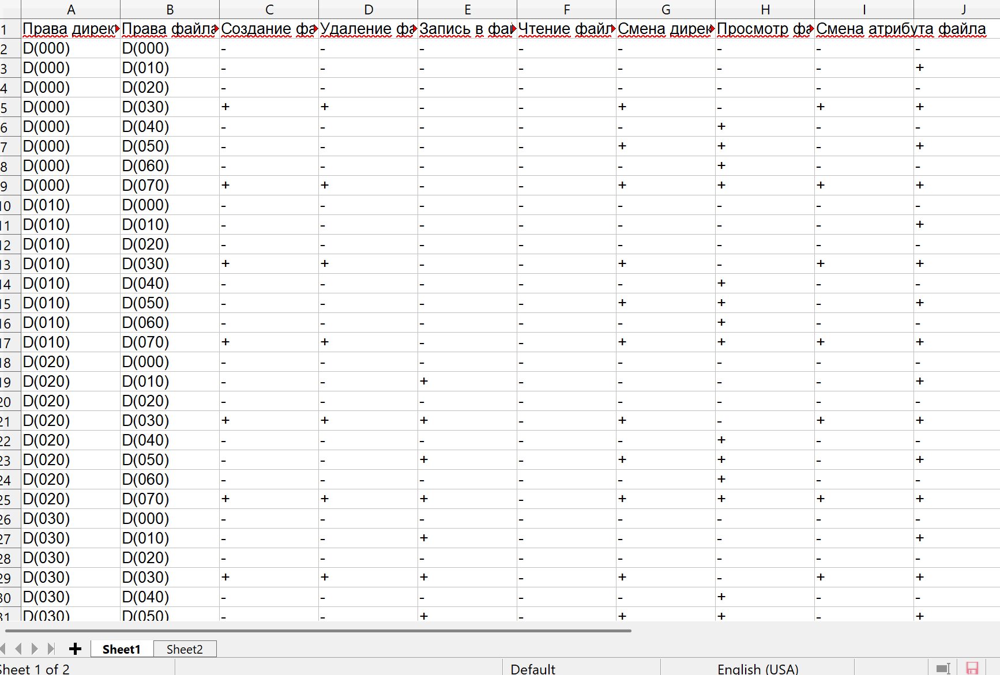

---
## Front matter
lang: ru-RU
title: Лабораторная работа №3
subtitle: Основы информационной безопасности
author:
  - Павлюченков С.В.
institute:
  - Российский университет дружбы народов, Москва, Россия
date: 07 сентября 25

## i18n babel
babel-lang: russian
babel-otherlangs: english

## Formatting pdf
toc: false
toc-title: Содержание
slide_level: 2
aspectratio: 169
section-titles: true
theme: metropolis
header-includes:
 - \metroset{progressbar=frametitle,sectionpage=progressbar,numbering=fraction}
---

## Докладчик

:::::::::::::: {.columns align=center}
::: {.column width="70%"}

  * Павлюченков Сергей Витальевич
  * Студент ФФМиЕН
  * Российский университет дружбы народов
  * [1132237372@pfur.ru](mailto:1132237372@pfur.ru)
  * <https://serapshi.github.io/svpavliuchenkov.github.io/>

:::
::: {.column width="30%"}

:::
::::::::::::::

## Цель работы

Получение практических навыков работы в консоли с атрибутами файлов для групп пользователей1

## Задание

1. В установленной операционной системе создайте учётную запись пользователя guest (использую учётную запись администратора):
useradd guest
2. Задайте пароль для пользователя guest (использую учётную запись администратора):
passwd guest
3. Аналогично создайте второго пользователя guest2.
4. Добавьте пользователя guest2 в группу guest:
gpasswd -a guest2 guest
5. Осуществите вход в систему от двух пользователей на двух разных консолях: guest на первой консоли и guest2 на второй консоли.
6. Для обоих пользователей командой pwd определите директорию, в которой вы находитесь. Сравните её с приглашениями командной строки.
7. Уточните имя вашего пользователя, его группу, кто входит в неё
и к каким группам принадлежит он сам. Определите командами
groups guest и groups guest2, в какие группы входят пользователи guest и guest2. Сравните вывод команды groups с выводом команд
id -Gn и id -G.
8. Сравните полученную информацию с содержимым файла /etc/group.
Просмотрите файл командой
cat /etc/group
9. От имени пользователя guest2 выполните регистрацию пользователя
guest2 в группе guest командой
newgrp guest
10. От имени пользователя guest измените права директории /home/guest,
разрешив все действия для пользователей группы:
chmod g+rwx /home/guest
11. От имени пользователя guest снимите с директории /home/guest/dir1
все атрибуты командой
chmod 000 dirl  и проверьте правильность снятия атрибутов.
Меняя атрибуты у директории dir1 и файла file1 от имени пользователя guest и делая проверку от пользователя guest2, заполните табл. 3.1,
определив опытным путём, какие операции разрешены, а какие нет. Если операция разрешена, занесите в таблицу знак «+», если не разрешена,
знак «-».
Сравните табл. 2.1 (из лабораторной работы № 2) и табл. 3.1.
На основании заполненной таблицы определите те или иные минимально необходимые права для выполнения пользователем guest2 операций
внутри директории dir1 и заполните табл. 3.2.

# Выполнение лабораторной работы

## Запуск guest и guest2

{#fig:001 width=70%}

## Сравнение guest и guest2 

{#fig:002 width=70%}

##  Просмотр информации о группах 

{#fig:003 width=70%}

## Создание новой группы 
{#fig:004 width=70%}

## Изменение атрибутов директории 

{#fig:005 width=70%}

## Взаимодействие с атрибутами

{#fig:006 width=70%}

## Итог работы

{#fig:007 width=70%}

## Выводы

Были получены навыки работы с консоли  с атрибутами файлов для групп пользователей.
