---
## Front matter
title: "Отчёта по лабораторной работе №3"
subtitle: "Основы информационной безопасности"
author: "Павлюченков Сергей Витальевич"

## Generic otions
lang: ru-RU
toc-title: "Содержание"

## Bibliography
bibliography: bib/cite.bib
csl: pandoc/csl/gost-r-7-0-5-2008-numeric.csl

## Pdf output format
toc: true # Table of contents
toc-depth: 2
lof: true # List of figures
lot: true # List of tables
fontsize: 12pt
linestretch: 1.5
papersize: a4
documentclass: scrreprt
## I18n polyglossia
polyglossia-lang:
  name: russian
  options:
  - spelling=modern
  - babelshorthands=true
polyglossia-otherlangs:
  name: english
## I18n babel
babel-lang: russian
babel-otherlangs: english
## Fonts
mainfont: PT Serif
romanfont: PT Serif
sansfont: PT Sans
monofont: PT Mono
mainfontoptions: Ligatures=TeX
romanfontoptions: Ligatures=TeX
sansfontoptions: Ligatures=TeX,Scale=MatchLowercase
monofontoptions: Scale=MatchLowercase,Scale=0.9
## Biblatex
biblatex: true
biblio-style: "gost-numeric"
biblatexoptions:
  - parentracker=true
  - backend=biber
  - hyperref=auto
  - language=auto
  - autolang=other*
  - citestyle=gost-numeric
## Pandoc-crossref LaTeX customization
figureTitle: "Рис."
tableTitle: "Таблица"
listingTitle: "Листинг"
lofTitle: "Список иллюстраций"
lotTitle: "Список таблиц"
lolTitle: "Листинги"
## Misc options
indent: true
header-includes:
  - \usepackage{indentfirst}
  - \usepackage{float} # keep figures where there are in the text
  - \floatplacement{figure}{H} # keep figures where there are in the text
---

# Цель работы

Получение практических навыков работы в консоли с атрибутами файлов для групп пользователей1
.

# Задание

1. В установленной операционной системе создайте учётную запись пользователя guest (использую учётную запись администратора):
useradd guest
2. Задайте пароль для пользователя guest (использую учётную запись администратора):
passwd guest
3. Аналогично создайте второго пользователя guest2.
4. Добавьте пользователя guest2 в группу guest:
gpasswd -a guest2 guest
5. Осуществите вход в систему от двух пользователей на двух разных консолях: guest на первой консоли и guest2 на второй консоли.
6. Для обоих пользователей командой pwd определите директорию, в которой вы находитесь. Сравните её с приглашениями командной строки.
7. Уточните имя вашего пользователя, его группу, кто входит в неё
и к каким группам принадлежит он сам. Определите командами
groups guest и groups guest2, в какие группы входят пользователи guest и guest2. Сравните вывод команды groups с выводом команд
id -Gn и id -G.
8. Сравните полученную информацию с содержимым файла /etc/group.
Просмотрите файл командой
cat /etc/group
9. От имени пользователя guest2 выполните регистрацию пользователя
guest2 в группе guest командой
newgrp guest
10. От имени пользователя guest измените права директории /home/guest,
разрешив все действия для пользователей группы:
chmod g+rwx /home/guest
11. От имени пользователя guest снимите с директории /home/guest/dir1
все атрибуты командой
chmod 000 dirl  и проверьте правильность снятия атрибутов.
Меняя атрибуты у директории dir1 и файла file1 от имени пользователя guest и делая проверку от пользователя guest2, заполните табл. 3.1,
определив опытным путём, какие операции разрешены, а какие нет. Если операция разрешена, занесите в таблицу знак «+», если не разрешена,
знак «-».
Сравните табл. 2.1 (из лабораторной работы № 2) и табл. 3.1.
На основании заполненной таблицы определите те или иные минимально необходимые права для выполнения пользователем guest2 операций
внутри директории dir1 и заполните табл. 3.2.

# Выполнение лабораторной работы

В установленной операционной системе создаю учётную запись пользователя guest2 (рис. [-@fig:001]).

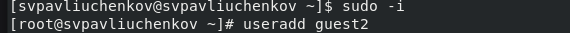{#fig:001 width=70%}

Задаю пароль для пользователя guest2 (рис. [-@fig:002]).

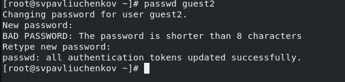{#fig:002 width=70%}

Добавил пользователя guest2 в группу guest (рис. [-@fig:003]).

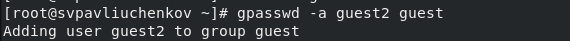{#fig:003 width=70%}

Осуществите вход в систему от двух пользователей на двух разных консолях: guest на первой консоли и guest2 на второй консоли. (рис. [-@fig:004]).

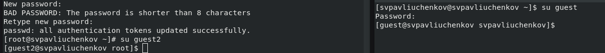{#fig:004 width=70%}

Для обоих пользователей командой pwd определите директорию, в которой вы находитесь. (рис. [-@fig:005]).

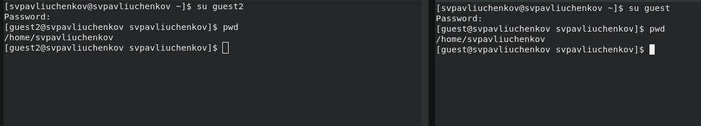{#fig:005 width=70%}

Уточняю имя вашего пользователя, его группу, кто входит в неё
и к каким группам принадлежит он сам. Определяю командами
groups guest и groups guest2, в какие группы входят пользователи guest и guest2. (рис. [-@fig:006]).

Выводом команд id -Gn и id -G откличается тем, что первая выводит группы в дискретном значении, другая в буквенном.

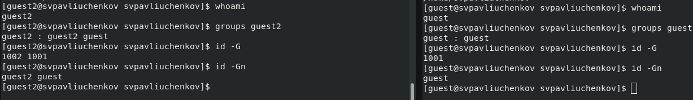{#fig:006 width=70%}

Просматриваю файл командой
cat /etc/group (рис. [-@fig:007]).

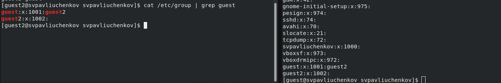{#fig:007 width=70%}

От имени пользователя guest2 выполнил регистрацию пользователя
guest2 в группе guest командой
newgrp guest (рис. [-@fig:008]).

{#fig:008 width=70%}

От имени пользователя guest изменил права директории /home/guest,
разрешив все действия для пользователей группы:
chmod g+rwx /home/guest (рис. [-@fig:009]).

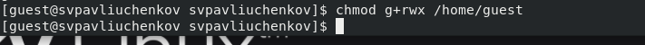{#fig:009 width=70%}

От имени пользователя guest снял с директории /home/guest/dir1
все атрибуты командой
chmod 000 dirl (рис. [-@fig:010]).

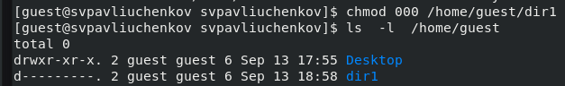{#fig:010 width=70%}

Проверил правильность снятия атрибутов (рис. [-@fig:011]).

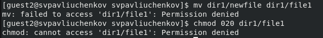{#fig:011 width=70%}

Итерационным путем получил таблицу 3.1 (рис. [-@fig:012]).

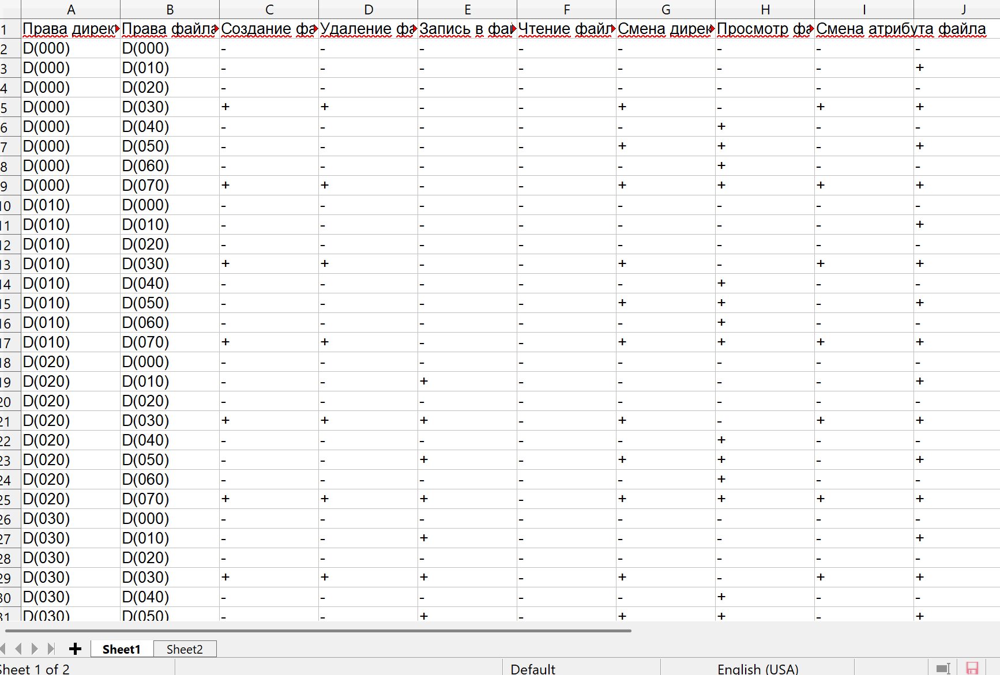{#fig:012 width=70%}

Из таблицы 3.1 получил таблицу 3.2 (рис. [-@fig:013]).

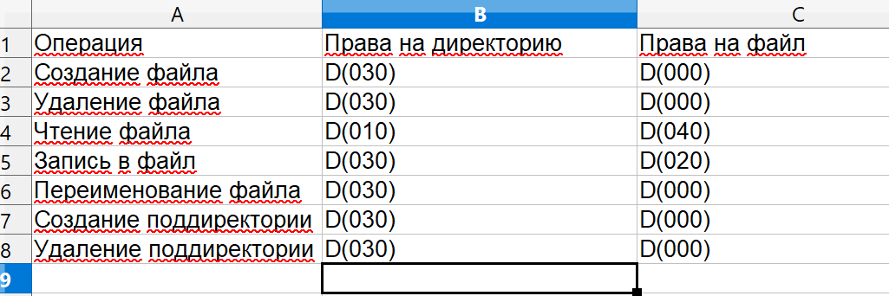{#fig:013 width=70%}

# Выводы

Были получены навыки работы с консоли  с атрибутами файлов для групп пользователей.

::: 
:::