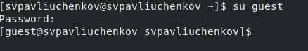
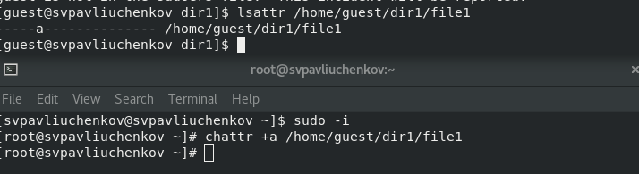
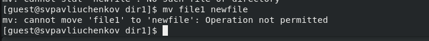
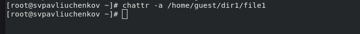
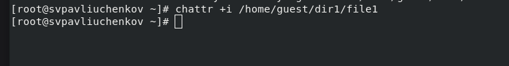
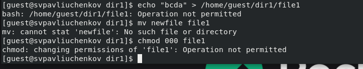

---
## Front matter
lang: ru-RU
title: Лабораторная работа №4
subtitle: Основы информационной безопасности
author:
  - Павлюченков С.В.
institute:
  - Российский университет дружбы народов, Москва, Россия
date: 07 сентября 25

## i18n babel
babel-lang: russian
babel-otherlangs: english

## Formatting pdf
toc: false
toc-title: Содержание
slide_level: 2
aspectratio: 169
section-titles: true
theme: metropolis
header-includes:
 - \metroset{progressbar=frametitle,sectionpage=progressbar,numbering=fraction}
---

## Докладчик

:::::::::::::: {.columns align=center}
::: {.column width="70%"}

  * Павлюченков Сергей Витальевич
  * Студент ФФМиЕН
  * Российский университет дружбы народов
  * [1132237372@pfur.ru](mailto:1132237372@pfur.ru)
  * <https://serapshi.github.io/svpavliuchenkov.github.io/>

:::
::: {.column width="30%"}

:::
::::::::::::::

## Цель работы

Получение практических навыков работы в консоли с расширенными
атрибутами файлов.

## Задание

1. От имени пользователя guest определите расширенные атрибуты файла
/home/guest/dir1/file1 командой
lsattr /home/guest/dir1/file1
2. Установите командой
chmod 600 file1
на файл file1 права, разрешающие чтение и запись для владельца файла.
3. Попробуйте установить на файл /home/guest/dir1/file1 расширенный атрибут a от имени пользователя guest:
chattr +a /home/guest/dir1/file1
В ответ вы должны получить отказ от выполнения операции.
4. Зайдите на третью консоль с правами администратора либо повысьте
свои права с помощью команды su. Попробуйте установить расширенный атрибут a на файл /home/guest/dir1/file1 от имени суперпользователя:
chattr +a /home/guest/dir1/file1
5. От пользователя guest проверьте правильность установления атрибута:
lsattr /home/guest/dir1/file1
6. Выполните дозапись в файл file1 слова «test» командой
echo "test" /home/guest/dir1/file1
После этого выполните чтение файла file1 командой
cat /home/guest/dir1/file1
Убедитесь, что слово test было успешно записано в file1.
7. Попробуйте удалить файл file1 либо стереть имеющуюся в нём информацию командой
echo "abcd" > /home/guest/dirl/file1
Попробуйте переименовать файл.
8. Попробуйте с помощью команды
chmod 000 file1
установить на файл file1 права, например, запрещающие чтение и запись для владельца файла. Удалось ли вам успешно выполнить указанные команды?
9. Снимите расширенный атрибут a с файла /home/guest/dirl/file1 от
имени суперпользователя командой
chattr -a /home/guest/dir1/file1
Повторите операции, которые вам ранее не удавалось выполнить. Ваши
наблюдения занесите в отчёт.
10. Повторите ваши действия по шагам, заменив атрибут «a» атрибутом «i».
Удалось ли вам дозаписать информацию в файл? Ваши наблюдения занесите в отчёт.

# Выполнение лабораторной работы

## Запуск гостевого пользователя

{#fig:001 width=70%}

## Добавление атрибута в режиме супер-пользователя

{#fig:002 width=70%}

##  Операции с файлом под атрибутом a

{#fig:003 width=70%}

## Убираю атрибут a 
{#fig:004 width=70%}

## Добавляю атрибут i  

{#fig:005 width=70%}

## Повторяю операции с атрибутом i 

svpavliuchenkov

{#fig:006 width=70%}

## Выводы

В результате выполнения работы я повысил свои навыки использования интерфейса командой строки (CLI), познакомился на примерах с тем,
как используются основные и расширенные атрибуты при разграничении
доступа. Опробовал действие на практике расширенных атрибутов «а» и «i».
