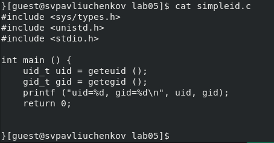
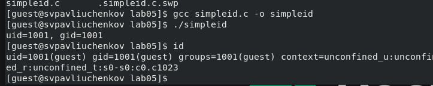
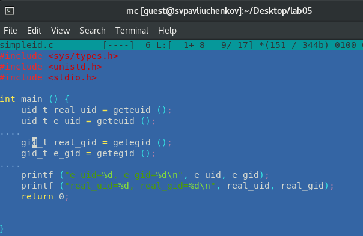
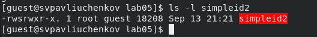
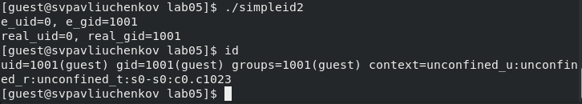
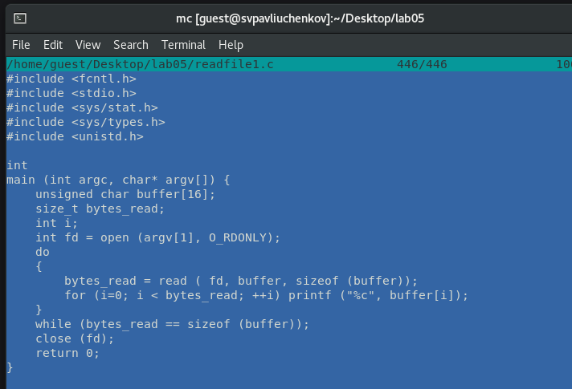
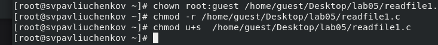

---
## Front matter
lang: ru-RU
title: Лабораторная работа №5
subtitle: Основы информационной безопасности
author:
  - Павлюченков С.В.
institute:
  - Российский университет дружбы народов, Москва, Россия
date: 07 сентября 25

## i18n babel
babel-lang: russian
babel-otherlangs: english

## Formatting pdf
toc: false
toc-title: Содержание
slide_level: 2
aspectratio: 169
section-titles: true
theme: metropolis
header-includes:
 - \metroset{progressbar=frametitle,sectionpage=progressbar,numbering=fraction}
---

## Докладчик

:::::::::::::: {.columns align=center}
::: {.column width="70%"}

  * Павлюченков Сергей Витальевич
  * Студент ФФМиЕН
  * Российский университет дружбы народов
  * [1132237372@pfur.ru](mailto:1132237372@pfur.ru)
  * <https://serapshi.github.io/svpavliuchenkov.github.io/>

:::
::: {.column width="30%"}

:::
::::::::::::::

## Цель работы

Изучение механизмов изменения идентификаторов, применения
SetUID- и Sticky-битов. Получение практических навыков работы в консоли с дополнительными атрибутами. Рассмотрение работы механизма
смены идентификатора процессов пользователей, а также влияние бита
Sticky на запись и удаление файлов

## Задание

Войдите как guest.

Создайте и скомпилируйте simpleid.c.

Запустите simpleid и проверьте идентификаторы с помощью команды id.

Усложните программу и запустите simpleid2.

Проверьте атрибуты для simpleid2.

Скомпилируйте readfile.c.

Смените владельца и атрибуты файла на readfile.

Создайте файл file01.txt в /tmp.

Проверьте доступ пользователя guest2 к файлу.

Снимите атрибут Sticky с /tmp.

# Выполнение лабораторной работы

## Создание simpleid.c

{#fig:001 width=70%}

## Проверка работы файла

{#fig:002 width=70%}

##  Листинг simpleid2.c 

{#fig:003 width=70%}

## Атрибуты simpleid2 
{#fig:004 width=70%}

## Данные об id пользователя guest

{#fig:005 width=70%}

## Листинг readfile.c 

{#fig:006 width=70%}

## Смена владельца readfile.c

{#fig:007 width=70%}

## Проверка Sticky

Проверяем папку tmp на наличие атрибута Sticky, т.к. в выводе есть буква t, то атрибут установлен 

{#fig:018 width=70%}

## Итог работы

По результатам без Sticky-бита запись в файл и дозапись в файл оказались возможной, зато удаление файла прошло неудачно, а с наоборот.

{#fig:025 width=70%}

## Выводы

Изучил механизм изменения идентификаторов, применил
SetUID- и Sticky-биты. Получил практические навыки работы в консоли с дополнительными атрибутами. Рассмотрел работу механизма
смены идентификатора процессов пользователей, а также влияние бита
Sticky на запись и удаление файлов.
