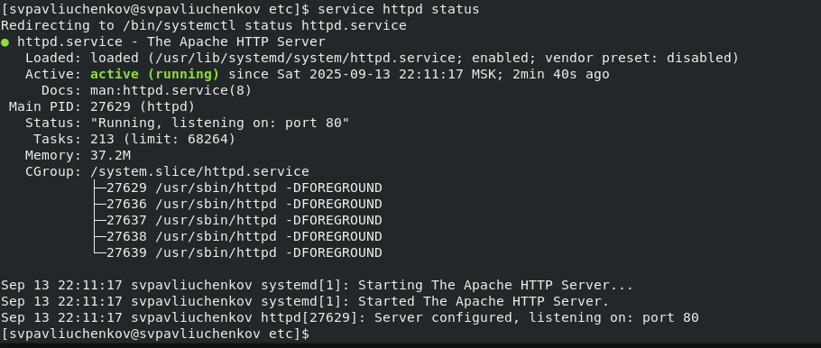
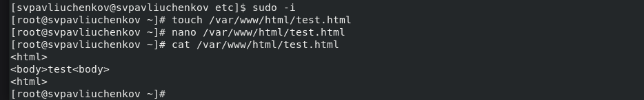
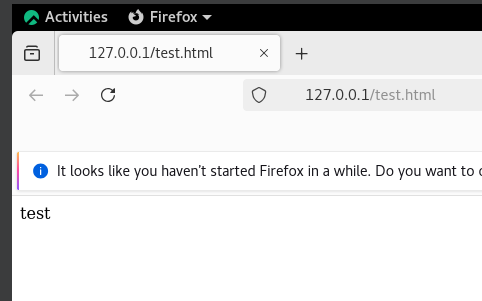
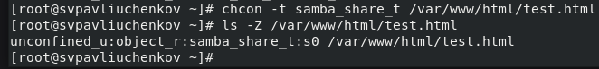
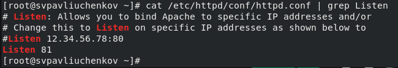
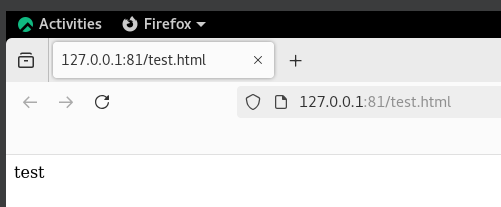
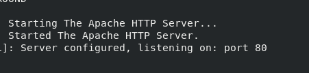

---
## Front matter
lang: ru-RU
title: Лабораторная работа №6
subtitle: Основы информационной безопасности
author:
  - Павлюченков С.В.
institute:
  - Российский университет дружбы народов, Москва, Россия
date: 07 сентября 25

## i18n babel
babel-lang: russian
babel-otherlangs: english

## Formatting pdf
toc: false
toc-title: Содержание
slide_level: 2
aspectratio: 169
section-titles: true
theme: metropolis
header-includes:
 - \metroset{progressbar=frametitle,sectionpage=progressbar,numbering=fraction}
---

## Докладчик

:::::::::::::: {.columns align=center}
::: {.column width="70%"}

  * Павлюченков Сергей Витальевич
  * Студент ФФМиЕН
  * Российский университет дружбы народов
  * [1132237372@pfur.ru](mailto:1132237372@pfur.ru)
  * <https://serapshi.github.io/svpavliuchenkov.github.io/>

:::
::: {.column width="30%"}

:::
::::::::::::::

## Цель работы

Развить навыки администрирования ОС Linux. Получить первое практическое знакомство с технологией SELinux1
.
Проверить работу SELinx на практике совместно с веб-сервером
Apache.

## Задание

1. Войдите в систему с полученными учётными данными и убедитесь, что
SELinux работает в режиме enforcing политики targeted с помощью команд getenforce и sestatus.
2. Обратитесь с помощью браузера к веб-серверу, запущенному на вашем
компьютере, и убедитесь, что последний работает:
Если не работает, запустите его так же, но с параметром start.
3. Найдите веб-сервер Apache в списке процессов, определите его контекст
безопасности и занесите эту информацию в отчёт. Например, можно использовать команду
ps auxZ | grep httpd
4. Посмотрите текущее состояние переключателей SELinux для Apache с
помощью команды
sestatus -bigrep httpd
Обратите внимание, что многие из них находятся в положении «off»
5. Посмотрите статистику по политике с помощью команды seinfo, также
определите множество пользователей, ролей, типов.
6. Определите тип файлов и поддиректорий, находящихся в директории
/var/www
7. Определите тип файлов, находящихся в директории /var/www/html:
ls -lZ /var/www/html
8. Определите круг пользователей, которым разрешено создание файлов в
директории /var/www/html.
9. Создайте от имени суперпользователя (так как в дистрибутиве после установки только ему разрешена запись в директорию) html-файл
/var/www/html/test.html
10. Проверьте контекст созданного вами файла. Занесите в отчёт контекст,
присваиваемый по умолчанию вновь созданным файлам в директории
/var/www/html.
11. Обратитесь к файлу через веб-сервер, введя в браузере адрес
http://127.0.0.1/test.html. Убедитесь, что файл был успешно отображён.
12. Изучите справку man httpd_selinux и выясните, какие контексты файлов определены для httpd. Сопоставьте их с типом файла
test.html. 
Тип httpd_sys_content_t позволяет процессу httpd получить доступ к файлу. Благодаря наличию последнего типа мы получили доступ к файлу
при обращении к нему через браузер.
13. Измените контекст файла /var/www/html/test.html с
httpd_sys_content_t на любой другой, к которому процесс httpd не
должен иметь доступа, например, на samba_share_t:
chcon -t samba_share_t /var/www/html/test.html
ls -Z /var/www/html/test.html
4. Попробуйте ещё раз получить доступ к файлу через веб-сервер, введя в
браузере адрес http://127.0.0.1/test.html.
15. Проанализируйте ситуацию. Почему файл не был отображён, если права
доступа позволяют читать этот файл любому пользователю?
ls -l /var/www/html/test.html
Просмотрите log-файлы веб-сервера Apache. Также просмотрите системный лог-файл:
tail /var/log/messages
Если в системе окажутся запущенными процессы setroubleshootd и
audtd, то вы также сможете увидеть ошибки, аналогичные указанным
выше, в файле /var/log/audit/audit.log. Проверьте это утверждение самостоятельно.
16. Попробуйте запустить веб-сервер Apache на прослушивание ТСР-порта
81 (а не 80, как рекомендует IANA и прописано в /etc/services). Для
этого в файле /etc/httpd/httpd.conf найдите строчку Listen 80 и
замените её на Listen 81.
17. Выполните перезапуск веб-сервера Apache. Произошёл сбой? Поясните
почему?
18. Проанализируйте лог-файлы:
tail -nl /var/log/messages
Просмотрите файлы /var/log/http/error_log
19. Выполните команду
semanage port -a -t http_port_t -р tcp 81
После этого проверьте список портов 
Убедитесь, что порт 81 появился в списке.
20. Попробуйте запустить веб-сервер Apache ещё раз. Поняли ли вы, почему
он сейчас запустился, а в предыдущем случае не смог?
21. Верните контекст httpd_sys_cоntent__t к файлу /var/www/html/ test.html:
22. Исправьте обратно конфигурационный файл apache, вернув Listen 80.
23. Удалите привязку http_port_t к 81 порту:
и проверьте, что порт 81 удалён.
24. Удалите файл /var/www/html/test.html:
rm /var/www/html/test.html

# Выполнение лабораторной работы

## Запуск 

Обращаюсь с помощью браузера к веб-серверу, запущенному на
компьютере, и проверяю, что последний работает

{#fig:001 width=70%}

## Состояние Apache 

Смотрю текущее состояние переключателей SELinux для Apache

{#fig:002 width=70%}

##  Создание тестового html-файла 

Создаю от имени суперпользователя html-файл
/var/www/html/test.html следующего содержания:

{#fig:003 width=70%}

## Проверка отображёния файла

{#fig:004 width=70%}

## Смена контекста 

Изменяю контекст файла /var/www/html/test.html с
httpd_sys_content_t на samba_share_t из-за чего появилась ошибка отображения файла 

{#fig:005 width=70%}

## Смена поорт

В файле /etc/httpd/httpd.conf нахожу строчку Listen 80 и
заменяю её на Listen 81.

{#fig:006 width=70%}

## Отображение файла

Запускаю успешно файл с 81 портом

{#fig:007 width=70%}

## Возращение 80 порта

{#fig:008 width=70%}

## Выводы

В этой работе я улучшил навыки администрирования Linux, разобрался в SELinux, и научился пользоваться httpd и Apache.

