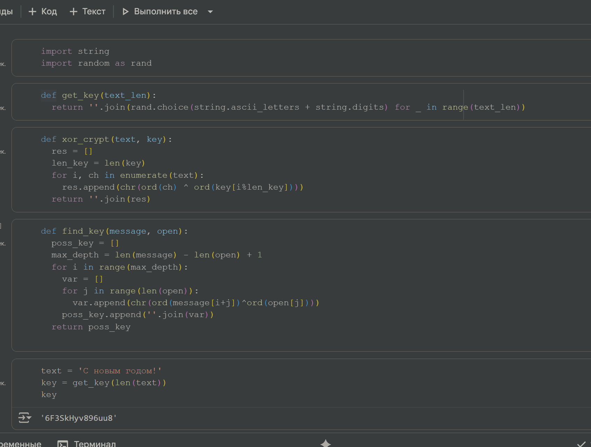
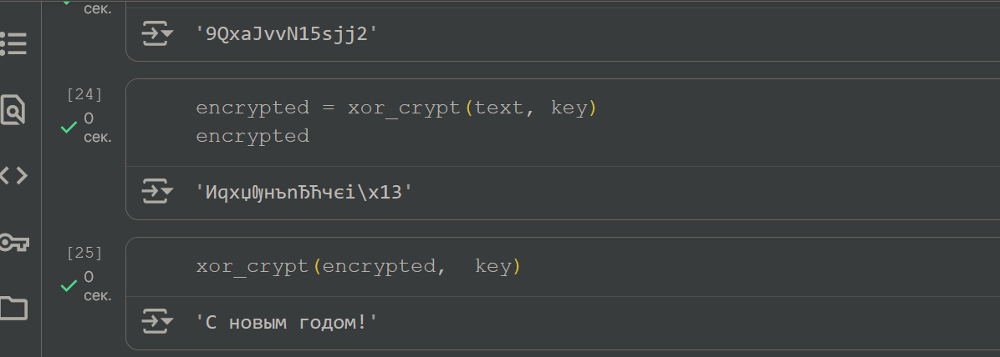

---
## Front matter
lang: ru-RU
title: Лабораторная работа №7
subtitle: Основы информационной безопасности
author:
  - Павлюченков С.В.
institute:
  - Российский университет дружбы народов, Москва, Россия
date: 07 сентября 25

## i18n babel
babel-lang: russian
babel-otherlangs: english

## Formatting pdf
toc: false
toc-title: Содержание
slide_level: 2
aspectratio: 169
section-titles: true
theme: metropolis
header-includes:
 - \metroset{progressbar=frametitle,sectionpage=progressbar,numbering=fraction}
---

## Докладчик

:::::::::::::: {.columns align=center}
::: {.column width="70%"}

  * Павлюченков Сергей Витальевич
  * Студент ФФМиЕН
  * Российский университет дружбы народов
  * [1132237372@pfur.ru](mailto:1132237372@pfur.ru)
  * <https://serapshi.github.io/svpavliuchenkov.github.io/>

:::
::: {.column width="30%"}

:::
::::::::::::::

## Цель работы

Освоить на практике применение режима однократного гаммирования1

## Задание

Нужно подобрать ключ, чтобы получить сообщение «С Новым Годом,
друзья!». Требуется разработать приложение, позволяющее шифровать и
дешифровать данные в режиме однократного гаммирования. Приложение
должно:
1. Определить вид шифротекста при известном ключе и известном открытом тексте.
2. Определить ключ, с помощью которого шифротекст может быть преобразован в некоторый фрагмент текста, представляющий собой один из
возможных вариантов прочтения открытого текста.

# Выполнение лабораторной работы

## Функции на Python

{#fig:001 width=70%}

## Код отдельно

Python
import string
import random as rand
def get_key(text_len):
  return ''.join(rand.choice(string.ascii_letters + string.digits) for _ in range(text_len))

def xor_crypt(text, key):
  res = []
  len_key = len(key)
  for i, ch in enumerate(text):
    res.append(chr(ord(ch) ^ ord(key[i%len_key])))
  return ''.join(res)

def find_key(message, open):
  poss_key = []
  max_depth = len(message) - len(open) + 1
  for i in range(max_depth):
    var = []
    for j in range(len(open)):
      var.append(chr(ord(message[i+j])^ord(open[j])))
    poss_key.append(''.join(var))
  return poss_key

## Дешифрование
Тут показано возможность и рабботоспособность обратного дешифрования при известном ключе (рис. [-@fig:002]).

{#fig:002 width=70%}

## Выводы

В этой работе я освоил на практике применение режима однократного гаммирования.
