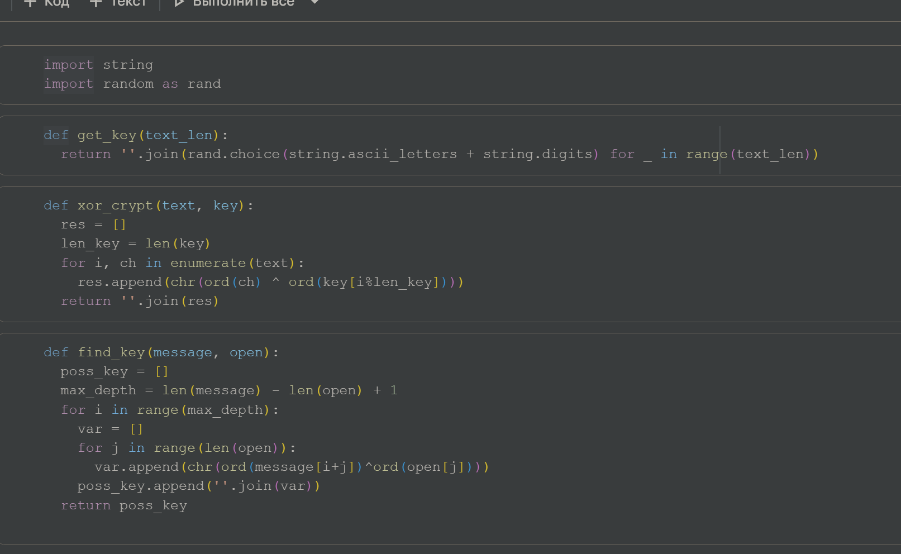
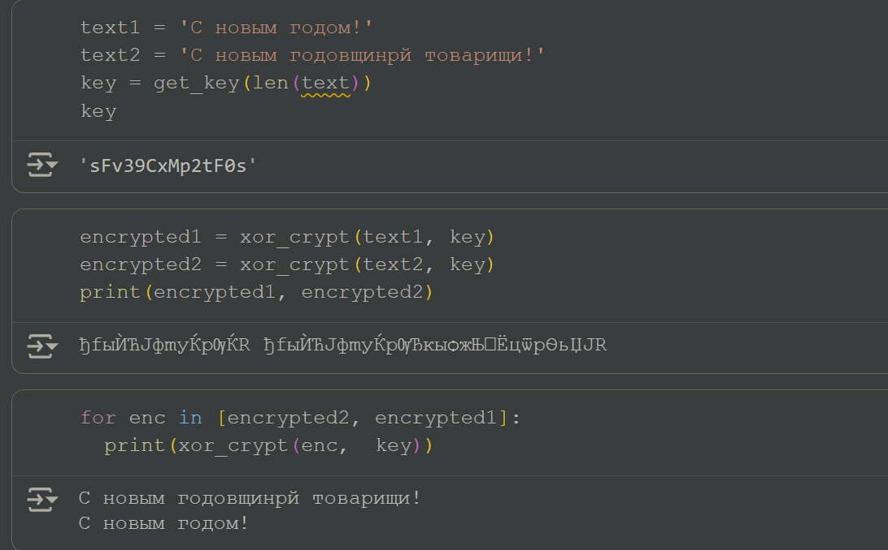
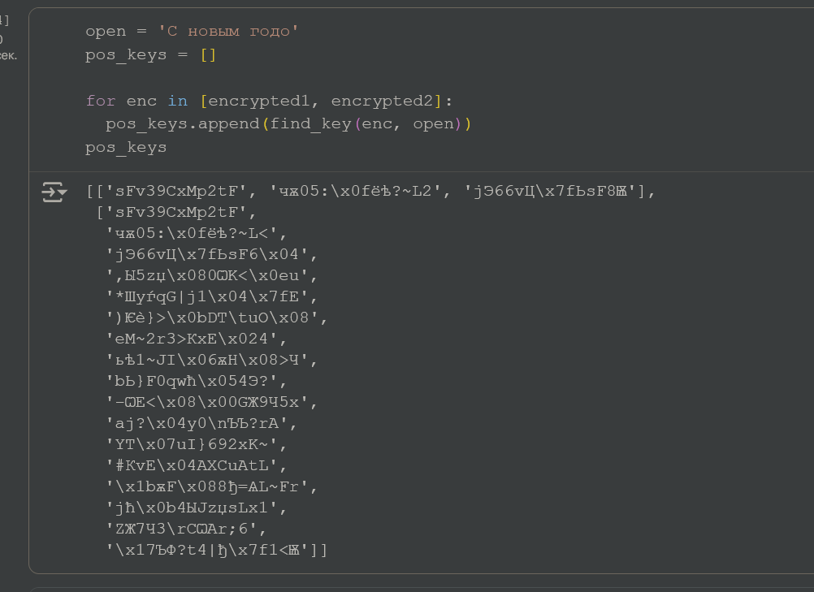
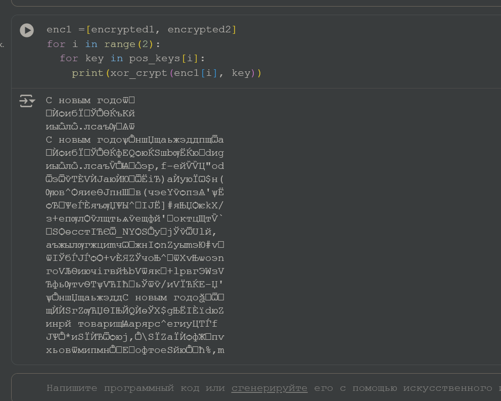

---
## Front matter
lang: ru-RU
title: Лабораторная работа №8
subtitle: Основы информационной безопасности
author:
  - Павлюченков С.В.
institute:
  - Российский университет дружбы народов, Москва, Россия
date: 07 сентября 25

## i18n babel
babel-lang: russian
babel-otherlangs: english

## Formatting pdf
toc: false
toc-title: Содержание
slide_level: 2
aspectratio: 169
section-titles: true
theme: metropolis
header-includes:
 - \metroset{progressbar=frametitle,sectionpage=progressbar,numbering=fraction}
---

## Докладчик

:::::::::::::: {.columns align=center}
::: {.column width="70%"}

  * Павлюченков Сергей Витальевич
  * Студент ФФМиЕН
  * Российский университет дружбы народов
  * [1132237372@pfur.ru](mailto:1132237372@pfur.ru)
  * <https://serapshi.github.io/svpavliuchenkov.github.io/>

:::
::: {.column width="30%"}

:::
::::::::::::::

## Цель работы

Освоить на практике применение режима однократного гаммирования
на примере кодирования различных исходных текстов одним ключом.

## Задание

Два текста кодируются одним ключом (однократное гаммирование).
Требуется не зная ключа и не стремясь его определить, прочитать оба текста. Необходимо разработать приложение, позволяющее шифровать и дешифровать тексты P1 и P2 в режиме однократного гаммирования. Приложение должно определить вид шифротекстов C1 и C2 обоих текстов P1 и
P2 при известном ключе ; Необходимо определить и выразить аналитически способ, при котором злоумышленник может прочитать оба текста, не
зная ключа и не стремясь его определить.

# Выполнение лабораторной работы

## Ранее написанный код

{#fig:001 width=70%}

## Шифрование

C помощью написаных ранее функций создаем уникальный ключ и шифрую им два предложения, после чего проверяю возможно обратно дешифрования 

{#fig:002 width=70%}

## Создание ключей 

По открытому слову создаю список возможных ключей для каждого предложения, так как они зашифрованы одним ключом, то в теории при подборе может оказаться два одинаковых ключа в в двух массивах, и тогда это может быть истиным, но в этом случае такого не было

{#fig:003 width=70%}

open = 'С новым годо'
pos_keys = []

for enc in [encrypted1, encrypted2]:
  pos_keys.append(find_key(enc, open))
pos_keys

## Дешифровка

После чего я дешифрую предложения каждым возможным ключом, и получаю предложения, с некоторым количеством информации(рис. [-@fig:004]).

{#fig:004 width=70%}

enc1 =[encrypted1, encrypted2]
for i in range(2):
  for key in pos_keys[i]:
    print(xor_crypt(enc1[i], key))

## Выводы

В данной лабораторной работе я освоил на практике применение режима однократного гаммирования
на примере кодирования различных исходных текстов одним ключом.
