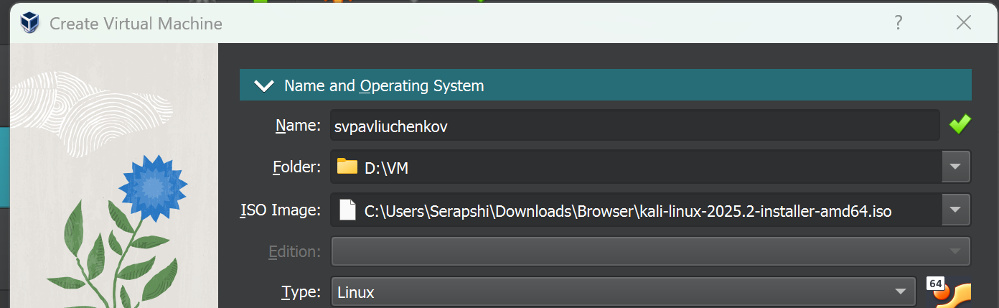
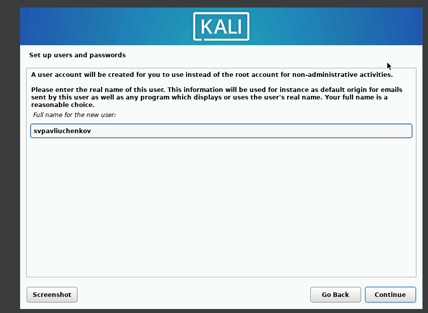
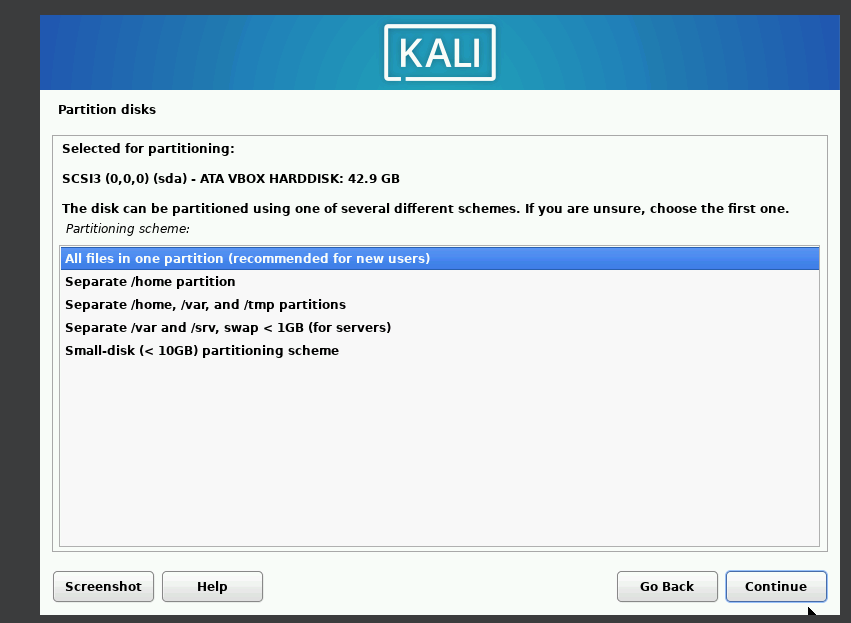
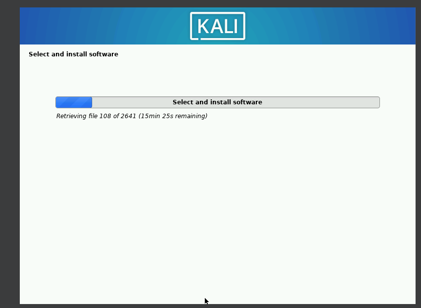
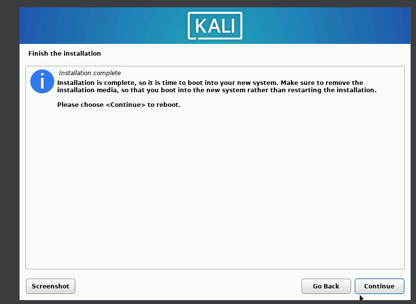
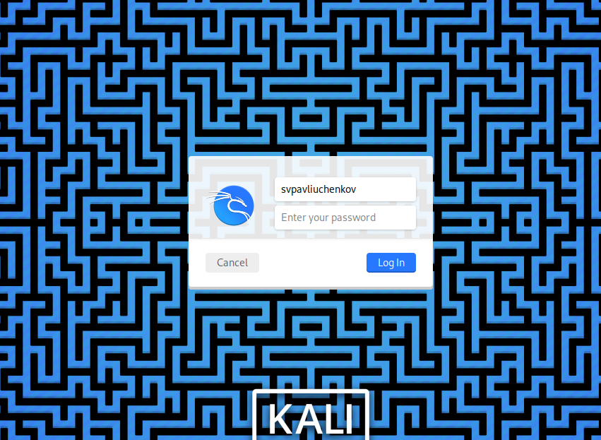

---
## Front matter
lang: ru-RU
title: Индивидуальный проект этап №1
subtitle: Основы информационной безопасности
author:
  - Павлюченков С.В.
institute:
  - Российский университет дружбы народов, Москва, Россия
date: 07 сентября 25

## i18n babel
babel-lang: russian
babel-otherlangs: english

## Formatting pdf
toc: false
toc-title: Содержание
slide_level: 2
aspectratio: 169
section-titles: true
theme: metropolis
header-includes:
 - \metroset{progressbar=frametitle,sectionpage=progressbar,numbering=fraction}
---

## Докладчик

:::::::::::::: {.columns align=center}
::: {.column width="70%"}

  * Павлюченков Сергей Витальевич
  * Студент ФФМиЕН
  * Российский университет дружбы народов
  * [1132237372@pfur.ru](mailto:1132237372@pfur.ru)
  * <https://serapshi.github.io/svpavliuchenkov.github.io/>

:::
::: {.column width="30%"}

:::
::::::::::::::

## Цель работы

Подготовка среды для выполнения индивидуального проекта

## Задание

Уставовить Kali Linux

# Выполнение лабораторной работы

## Запуск VM

{#fig:001 width=70%}

## Выбор имени пользователя 

{#fig:002 width=70%}

##  Выбор разметки диска 

{#fig:003 width=70%}

## Начало установки
{#fig:004 width=70%}

## Окончание уставовки 

{#fig:005 width=70%}

## Успешное создание пользователя svpavliuchenkov

После перезагрузка и открепления установочного образа установка закочена.
{#fig:006 width=70%}

## Выводы

В этом этапе я подготовил виртуальную машину для выполнения проекта.