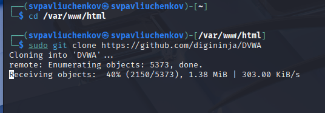
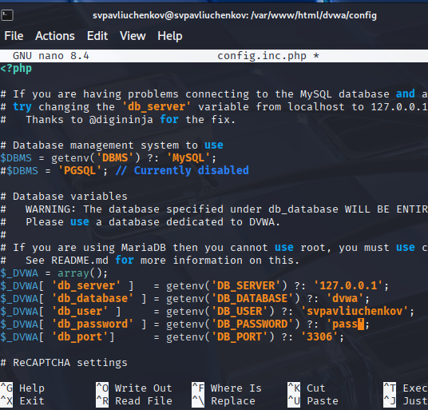
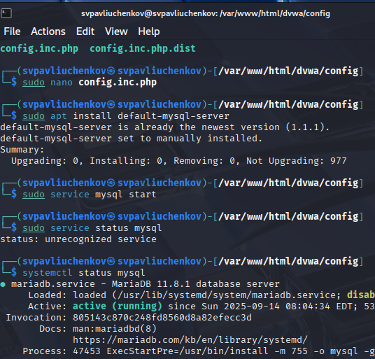
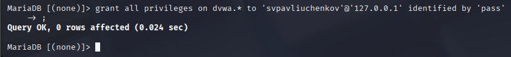
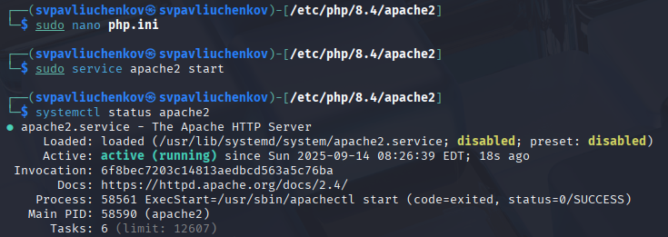
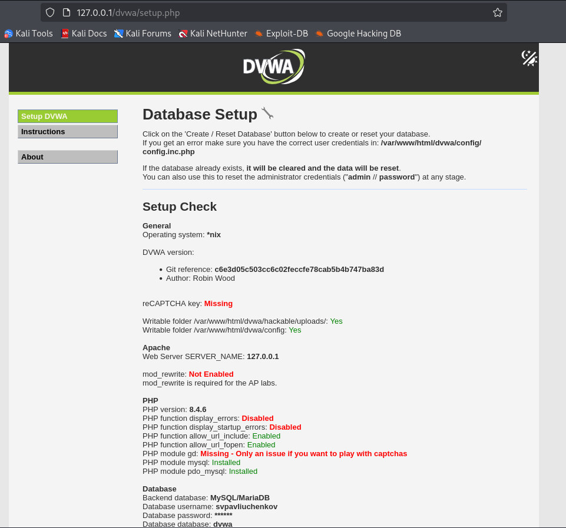
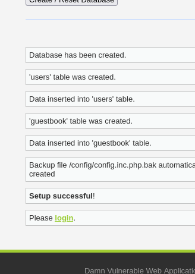

---
## Front matter
lang: ru-RU
title: Индивидуальный проект этап №2
subtitle: Основы информационной безопасности
author:
  - Павлюченков С.В.
institute:
  - Российский университет дружбы народов, Москва, Россия
date: 07 сентября 25

## i18n babel
babel-lang: russian
babel-otherlangs: english

## Formatting pdf
toc: false
toc-title: Содержание
slide_level: 2
aspectratio: 169
section-titles: true
theme: metropolis
header-includes:
 - \metroset{progressbar=frametitle,sectionpage=progressbar,numbering=fraction}
---

## Докладчик

:::::::::::::: {.columns align=center}
::: {.column width="70%"}

  * Павлюченков Сергей Витальевич
  * Студент ФФМиЕН
  * Российский университет дружбы народов
  * [1132237372@pfur.ru](mailto:1132237372@pfur.ru)
  * <https://serapshi.github.io/svpavliuchenkov.github.io/>

:::
::: {.column width="30%"}

:::
::::::::::::::

## Цель работы

Подготовить специально предназначенном для поиска уязвимостей веб приложении под названием Damn Vulnerable Web Application (DVWA).

## Задание

Установите DVWA в гостевую систему к Kali Linux.

# Выполнение лабораторной работы

## Установка DVWA 

{#fig:001 width=70%}

## Установка имени пользователя и пароля для базы данных 

{#fig:002 width=70%}

##  Запуск MySQL 

{#fig:003 width=70%}

## Добавление всех прав для пользователя  
{#fig:004 width=70%}

## Подключение к Apache 

{#fig:005 width=70%}

## Открытие DVWA в браузере

{#fig:006 width=70%}

## Настройка DVWA

{#fig:007 width=70%}

## Выводы

На этом этапе я подготовил веб интерфейс для работы и тестирования по в следующих этапах
