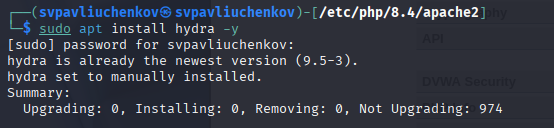
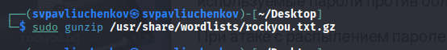
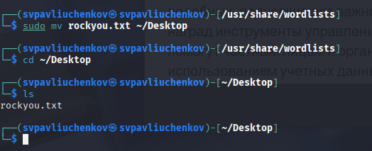
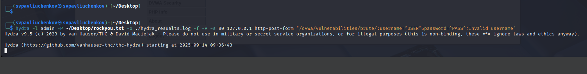
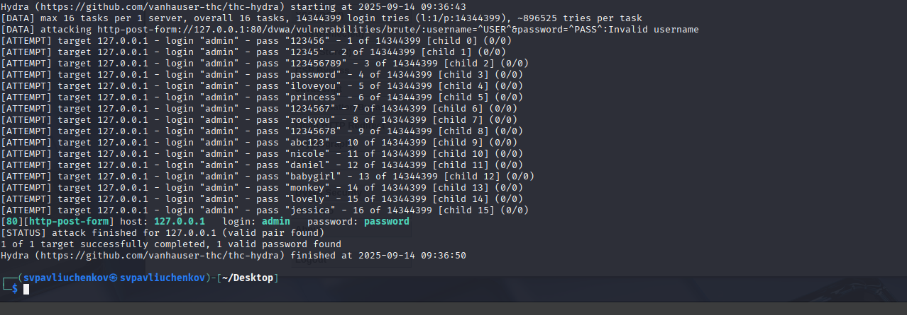
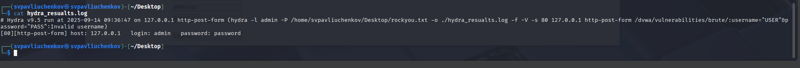

---
## Front matter
lang: ru-RU
title: Индивидуальный проект этап №3
subtitle: Основы информационной безопасности
author:
  - Павлюченков С.В.
institute:
  - Российский университет дружбы народов, Москва, Россия
date: 07 сентября 25

## i18n babel
babel-lang: russian
babel-otherlangs: english

## Formatting pdf
toc: false
toc-title: Содержание
slide_level: 2
aspectratio: 169
section-titles: true
theme: metropolis
header-includes:
 - \metroset{progressbar=frametitle,sectionpage=progressbar,numbering=fraction}
---

## Докладчик

:::::::::::::: {.columns align=center}
::: {.column width="70%"}

  * Павлюченков Сергей Витальевич
  * Студент ФФМиЕН
  * Российский университет дружбы народов
  * [1132237372@pfur.ru](mailto:1132237372@pfur.ru)
  * <https://serapshi.github.io/svpavliuchenkov.github.io/>

:::
::: {.column width="30%"}

:::
::::::::::::::

## Цель работы

Использование Hydra
Hydra используется для подбора или взлома имени пользователя и пароля.
Поддерживает подбор для большого набора приложений.

## Задание

Пример работы:
Исходные данные:
IP сервера 178.72.90.181;
Сервис http на стандартном 80 порту;
Для авторизации используется html форма, которая отправляет по адресу http://178.72.90.181/cgi-bin/luci методом POST запрос вида username=root&password=test_password;
В случае не удачной аутентификации пользователь наблюдает сообщение Invalid username and/or password! Please try again.
Запрос к Hydra будет выглядеть примерно так:

hydra -l root -P ~/pass_lists/dedik_passes.txt -o ./hydra_result.log -f -V -s 80 178.72.90.181 http-post-form "/cgi-bin/luci:username=^USER^&password=^PASS^:Invalid username"
Используется http-post-form потому, что авторизация происходит по http методом post.
После указания этого модуля идёт строка /cgi-bin/luci:username=^USER^&password=^PASS^:Invalid username, у которой через двоеточие (:) указывается:
путь до скрипта, который обрабатывает процесс аутентификации (/cgi-bin/luci);
строка, которая передаётся методом POST, в которой логин и пароль заменены на ^USER^ и ^PASS^ соответственно (username=^USER^&password=^PASS^);
строка, которая присутствует на странице при неудачной аутентификации; при её отсутствии Hydra поймёт, что мы успешно вошли (Invalid username).

# Выполнение лабораторной работы

## Установка Hydra 

{#fig:001 width=70%}

## Распаковка файла для перебора паролей 

{#fig:002 width=70%}

##  Перемещения данных 

{#fig:003 width=70%}

## Открепление 

hydra -l root -P ~/pass_lists/dedik_passes.txt -o ./hydra_result.log -f -V -s 80 178.72.90.181 http-post-form "/cgi-bin/luci:username=^USER^&password=^PASS^:Invalid username"

{#fig:004 width=70%}

## Вывод Hydra 

{#fig:005 width=70%}

## Логи Hydra

{#fig:006 width=70%}

## Выводы

В этом этапе я научился пользоваться ПО Hydra для брутфорсинга паролей и логинов и интерфейсом DVWA/brute force.
