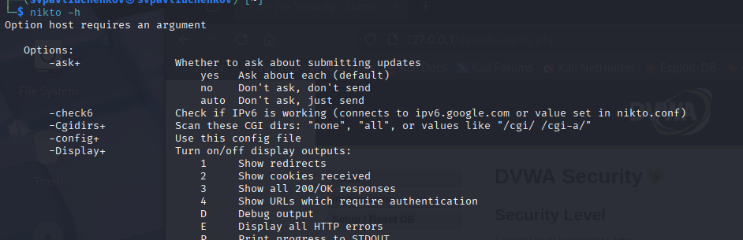
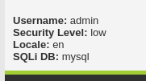
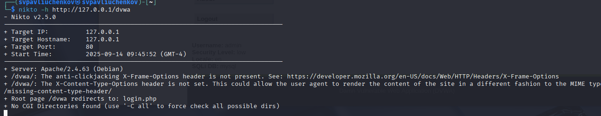
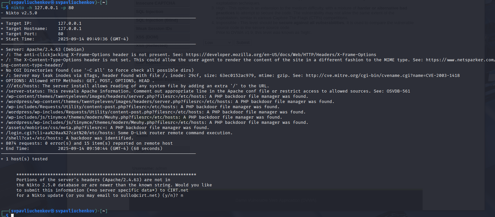
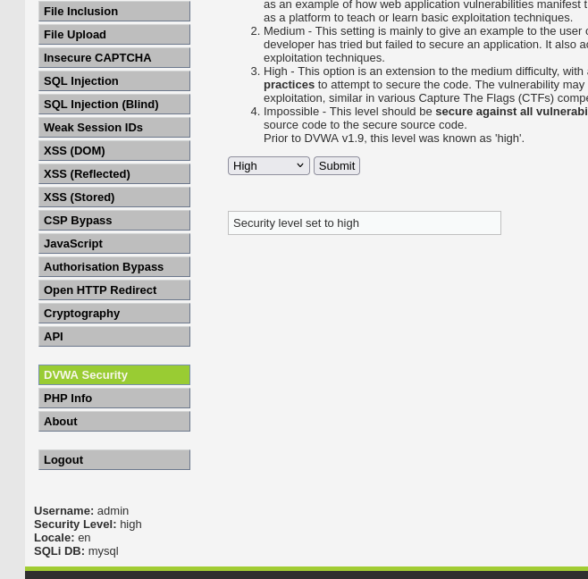
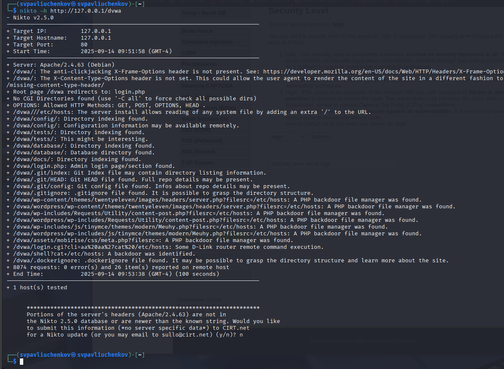

---
## Front matter
lang: ru-RU
title: Индивидуальный проект этап №4
subtitle: Основы информационной безопасности
author:
  - Павлюченков С.В.
institute:
  - Российский университет дружбы народов, Москва, Россия
date: 07 сентября 25

## i18n babel
babel-lang: russian
babel-otherlangs: english

## Formatting pdf
toc: false
toc-title: Содержание
slide_level: 2
aspectratio: 169
section-titles: true
theme: metropolis
header-includes:
 - \metroset{progressbar=frametitle,sectionpage=progressbar,numbering=fraction}
---

## Докладчик

:::::::::::::: {.columns align=center}
::: {.column width="70%"}

  * Павлюченков Сергей Витальевич
  * Студент ФФМиЕН
  * Российский университет дружбы народов
  * [1132237372@pfur.ru](mailto:1132237372@pfur.ru)
  * <https://serapshi.github.io/svpavliuchenkov.github.io/>

:::
::: {.column width="30%"}

:::
::::::::::::::

## Цель работы

Использование nikto
nikto — базовый сканер безопасности веб-сервера. Он сканирует и обнаруживает уязвимости в веб-приложениях, обычно вызванные неправильной конфигурацией на самом сервере, файлами, установленными по умолчанию, и небезопасными файлами, а также устаревшими серверными приложениями.

# Выполнение лабораторной работы

## Проверка факта установки nikto 

{#fig:001 width=70%}

## Изменение настроек безопасности DVWA на низкие

{#fig:002 width=70%}

##  Запуск nikto

{#fig:003 width=70%}

## Результат работы 

{#fig:004 width=70%}

## Изменение настроек безопасности DVWA на высокие

{#fig:005 width=70%}

## Результат работы 

{#fig:006 width=70%}

## Выводы

В этом этапе я научился пользоваться nikto вместе с dvwa для нахождения уязвимостей с примерами из dvwa.