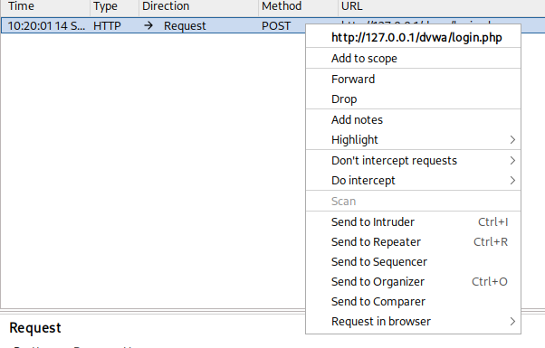

---
## Front matter
lang: ru-RU
title: Индивидуальный проект этап №5
subtitle: Основы информационной безопасности
author:
  - Павлюченков С.В.
institute:
  - Российский университет дружбы народов, Москва, Россия
date: 07 сентября 25

## i18n babel
babel-lang: russian
babel-otherlangs: english

## Formatting pdf
toc: false
toc-title: Содержание
slide_level: 2
aspectratio: 169
section-titles: true
theme: metropolis
header-includes:
 - \metroset{progressbar=frametitle,sectionpage=progressbar,numbering=fraction}
---

## Докладчик

:::::::::::::: {.columns align=center}
::: {.column width="70%"}

  * Павлюченков Сергей Витальевич
  * Студент ФФМиЕН
  * Российский университет дружбы народов
  * [1132237372@pfur.ru](mailto:1132237372@pfur.ru)
  * <https://serapshi.github.io/svpavliuchenkov.github.io/>

:::
::: {.column width="30%"}

:::
::::::::::::::

## Цель работы

Использование Burp Suite
Burp Suite представляет собой набор мощных инструментов безопасности веб-приложений, которые демонстрируют реальные возможности злоумышленника, проникающего в веб-приложения

# Выполнение лабораторной работы

## Запуск Burp Suite

{#fig:001 width=70%}

## Конфигурация прокси для работы 

{#fig:002 width=70%}

##  Включаем перехват запросов 

{#fig:003 width=70%}

## Перехват запроса 
{#fig:004 width=70%}

## Возможность пропуска запросов 

{#fig:005 width=70%}

## Подробная информации по запросам 

{#fig:006 width=70%}

## Попытка авторизации

{#fig:007 width=70%}

## Передача запроса в секцию злоумышленника 

{#fig:008 width=70%}

## Секция Intruder 

{#fig:009 width=70%}

## Создание списка для атаки (Sniper attack)

{#fig:010 width=70%}

## Запуск атаки на localhost:80

{#fig:011 width=70%}

## Выбор подстановки значений из списка

{#fig:012 width=70%}

## Пример запросы при атаке DVWA

{#fig:013 width=70%}

## Выводы

В этом этапе я научился пользоваться Burp Suite, а именно мощных инструментов безопасности веб-приложений, который демонстрируют реальные возможности злоумышленника, проникающего в веб-приложения и позволяет моделировать события заранее позволяя найти уязвимости.